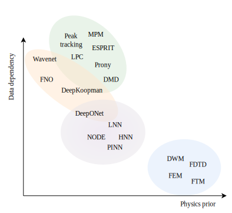
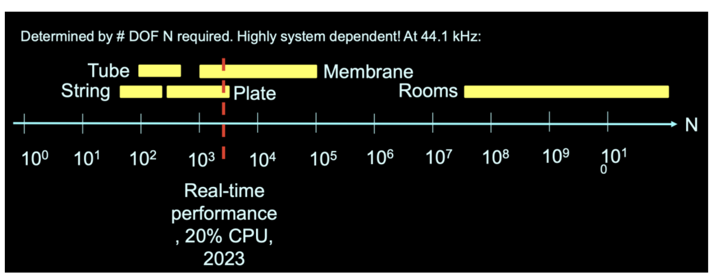

::: {style="text-align: center;"}

[github.com/rodrigodzf/physmod-ml-course]{style="font-size: 1.6em; font-weight: 600;"}

{width=35% fig-align="center"}

:::

## Overview

::: {.incremental}
- Practical information: logistics, schedule, resources
- Physics-based vs. data-driven approaches
- Two views of physics-based modelling, and the spectral baseline
- Continuous physics: PDEs, boundary and initial conditions
- Free vs. forced systems, damping
- Case study: the vibrating string
- The real-time constraint
- State-space form and nonlinearities
- Numerical simulation: time-stepping and stability
:::

::: {.notes}
Welcome to the course. This first session sets the scene for the entire course by introducing the philosophy and mathematical foundations of physics-based sound synthesis.
:::

# Practical Information

## Logistics

- **Room:** H 3001
- **Time:** 14--16, weekly from 7 May 2026
- **Credits:** 3 ECTS
- **Tools:** Python, JAX, PyTorch

. . .

**Important dates:**

- Course application deadline: 18.05.2026
- Project proposal deadline: 07.06.2026
- Project pitch: 25.06.2026
- Final presentation: 09.07.2026
- Code + paper submission: 30.09.2026

## Course Roadmap

| Week | Topic |
|------|-------|
| **1** | **Introduction to Physical Modelling** (today) |
| 2 | Modal and Finite-Difference Methods |
| 3 | Nonlinear Systems and Coupled Models |
| 4 | Differentiable Programming for Audio |
| 5 | Neural ODEs |
| 6 | Physics-Informed Neural Networks |
| 7 | Neural Operators (FNO) |
| 8 | Deep State-Space Models and Koopman Theory |
| 9 | Differentiable Physical Modelling for Parameter Estimation |
| 10 | Project Presentations |

: {.striped}

## Resources {style="font-size: 0.7em;"}

**Physics and numerical simulation**

- Bilbao, *Numerical Sound Synthesis: Finite Difference Schemes and Simulation in Musical Acoustics* (Wiley, 2009) -- main reference for FDTD and energy methods.
- Fletcher and Rossing, *The Physics of Musical Instruments* (Springer, 2nd ed., 1998) -- physical foundations.
- Trautmann and Rabenstein, *Digital Sound Synthesis by Physical Modeling Using the Functional Transformation Method* (Springer, 2003) -- FTM and transform-based synthesis.
- Smith, *Physical Audio Signal Processing* -- [ccrma.stanford.edu/~jos/pasp/](https://ccrma.stanford.edu/~jos/pasp/)

**Combining physics and neural networks**

- ETH Zurich, *Deep Learning in Scientific Computing* (Mishra and Moseley, 2023) -- [camlab.ethz.ch/teaching/deep-learning-in-scientific-computing-2023](https://camlab.ethz.ch/teaching/deep-learning-in-scientific-computing-2023.html)
- ISMIR 2025 tutorial on Differentiable Physical Modeling Sound Synthesis: [ismir-physical-modeling.github.io](https://ismir-physical-modeling.github.io/)

**Audio Synthesis and DDSP**

- ISMIR 2023 tutorial on Introduction to Differentiable Audio Synthesiser Programming: [intro2ddsp.github.io/intro.html](https://intro2ddsp.github.io/intro.html)

# Physics-based Audio vs. Data-driven Approaches

## Two Paradigms

:::: {.columns}

::: {.column width="50%"}
### Physics-based

- No audio samples used
- Sound generated from mathematical description
- Compact and lightweight, often just kilobytes
- Recursive systems at audio rate (IIR)
- Deterministic
:::

::: {.column width="50%"}
### Data-driven

- Learns from recorded audio
- Requires large datasets
- Models are large (MB--GB)
- Feed-forward or autoregressive
- Requires training and generalisation
:::

::::

## Two Paradigms

{fig-align="center"}

## What is a Model?

A model is a **simplified representation** of a system that lets us predict its behaviour.

. . .

:::: {.columns}
::: {.column width="50%"}
### Physics-based model
Derived from first principles (governing equations).

$$\dot{\mathbf{h}} = f(\mathbf{h}) + e(t)$$

:::

::: {.column width="50%"}
### Data-driven model
Learned from observations (input-output pairs).

$$\mathbf{y} = f_\theta(\mathbf{h}, e(t))$$

:::
::::

. . .

Both are approximations, they differ in where the knowledge comes from: **physical laws vs. data**

::: {.aside style="font-size: 0.1em;"}
Note: physics-based models can be *equation-based* (simulate the ODE/PDE numerically) or *solution-based* (evaluate a closed-form solution, e.g. $w(t) = A\cos(\omega t + \varphi)$). In practice, most systems of interest have no closed-form solution, so this course focuses on the equation-based approach.
:::

## Physics-based Audio: The goal

direct generation of high-quality, acoustic sound through numerical simulation.

. . .

**System families:**

- **1D** -- strings, bars, acoustic tubes
- **2D** -- membranes, plates
- **3D** -- enclosures, solid bodies

. . .

**Applications:**

- Synthesis (brass, percussion, strings)
- Effects (reverb, room simulation)

# Approaches to Physics-based Modelling

## Two Views of Physics-based Modelling {style="font-size: 0.8em;"}

:::: {.columns}

::: {.column width="50%"}
### Equation-based (dynamical systems view)

Discretise the governing PDE/ODE directly.

- Finite-Difference Time-Domain (FDTD)
- Finite Element Method (FEM)
- Modal methods
- Functional Transformation Method (FTM)

State variables: displacement, velocity, pressure fields.
:::

::: {.column width="50%"}
### Travelling-wave view

Reformulate the PDE in terms of left/right-going waves.

- Digital waveguides (DWG), waveguide meshes
- Wave Digital Filters (WDF) for lumped circuits/elements

State variables: wave components $w^+, w^-$.

Naturally passive, very efficient for 1D systems.
:::

::::

. . .

The two views are mathematically equivalent for linear lossless systems. **This course focuses on the equation-based view**, since it generalises more directly to nonlinear, multi-dimensional, and ML-hybrid models.

## Spectral Models

Assume the signal can be approximated as a sum of damped sinusoids:

$$y(t) = \sum_{k=1}^{K} A_k\, e^{-\alpha_k t} \cos(\omega_k t + \varphi_k)$$

. . .

**Synthesis side:** additive synthesis, subtractive synthesis, resonant filter banks.

**Analysis side:** spectral peak tracking, Prony's method, LPC, ESPRIT, DMD.

. . .

Cheap, interpretable, real-time friendly, and a workhorse of audio DSP since the 1980s.

## Why these aren't physical models

::: {.incremental}
- Parameters $(\omega_k, \alpha_k, A_k)$ are **fitted to a signal**, not derived from governing equations.
- No notion of geometry, material, boundary conditions, or excitation mechanism.
- Typically **single-point** in space, no spatial field $w(\mathbf{x}, t)$.
- Linear and time-invariant by construction, struggles with strong nonlinearity (tension modulation, collisions) and time-varying behaviour.
- Describes **what the sound looks like**, not **what produced it**.
:::

. . .

They sit alongside physical models as a useful baseline, and reappear later as the linear backbone of modal synthesis and Koopman-style learned models.

# From Continuous Physics to Discrete Computation

## Governing Equations

State is a field $w(\mathbf{x}, t)$ over a spatial domain $\Omega$ (string, membrane, air column), governed by a **PDE**.

. . .

1D wave equation:

$$\frac{\partial^2 w}{\partial t^2} = \hat{T}^2 \frac{\partial^2 w}{\partial x^2}$$

$w$: displacement. $\hat{T}$: wave speed.

. . .

Higher dimensions: replace $\partial^2/\partial x^2$ with the Laplacian $\Delta$.

. . .

Drop spatial dependency $\Rightarrow$ ODE (lumped oscillator).

## Boundary Conditions

A PDE alone is not enough. We must specify what happens **at the edges** of the domain.

. . .

For a string of length $L$, common boundary conditions:

| Type | Condition | Physical meaning |
|------|-----------|------------------|
| Fixed (Dirichlet) | $w(0,t) = w(L,t) = 0$ | Clamped ends (e.g. guitar string at nut and bridge) |
| Free (Neumann) | $\frac{\partial w}{\partial x}(0,t) = \frac{\partial w}{\partial x}(L,t) = 0$ | No transverse force at the boundary |

: {.striped}

## Boundary Conditions

<video src="images/string_boundary_conditions.mp4" controls style="width: 100%; max-height: 70vh; display: block; margin: 0 auto;"></video>

. . .

The choice of boundary conditions determines the **mode shapes** and **eigenfrequencies** of the system. When we discretise, BCs affect the structure of the resulting matrices (e.g. the corner entries of a discrete Laplacian). More on this in week 2.

## Initial Conditions

We also need to specify the state of the system **at time $t = 0$**.

. . .

For the wave equation (second order in time), we need two initial conditions:

$$w(x, 0) = w_0(x) \quad \text{(initial displacement)}$$

$$\frac{\partial w}{\partial t}(x, 0) = v_0(x) \quad \text{(initial velocity)}$$

. . .

For sound synthesis, we typically start **at rest**:

$$w_0(x) = 0, \quad v_0(x) = 0$$

and drive the system via an external force.

# Free vs. Forced Systems

## Why Synthesis Requires the Forced Form

A free system: $\dot{\mathbf{h}} = f(\mathbf{h})$, with initial conditions $\mathbf{h}(0) = \mathbf{h}_0$.

. . .

But in sound synthesis, the system starts **at rest**: $\mathbf{h}(0) = \mathbf{0}$.

Sound is initiated by an **external driving function**:

$$\dot{\mathbf{h}} = f(\mathbf{h}) + g(t)$$

. . .

This represents the physical interaction with the object (pluck, strike, bow, breath).

## Damping and Loss {auto-animate=true}

Real systems are never truly lossless. We add damping terms to the wave equation:

::: {data-id="damping-eq"}
$$\frac{\partial^2 w}{\partial t^2} = \hat{T}^2 \frac{\partial^2 w}{\partial x^2} + \delta(x - x_i) f(t)$$
:::

Undamped -- oscillations persist forever.

## Damping and Loss {auto-animate=true}

Real systems are never truly lossless. We add damping terms to the wave equation:

::: {data-id="damping-eq"}
$$\frac{\partial^2 w}{\partial t^2} = \hat{T}^2 \frac{\partial^2 w}{\partial x^2} \; {\color{cyan} - \hat{d}_1 \frac{\partial w}{\partial t} + \hat{d}_3 \frac{\partial^3 w}{\partial t \partial x^2}} \; + \delta(x - x_i) f(t)$$
:::

- $\hat{d}_1$: frequency-independent damping (all modes decay equally)
- $\hat{d}_3$: frequency-dependent damping (high frequencies decay faster -- realistic)

Even small damping profoundly affects decay and tonal quality. Musical instruments are "high-Q" systems. Low loss, but perceptually critical.

# Case Study: The Vibrating String

## The Wave Equation

The ideal vibrating string -- second-order linear wave equation:

$$\frac{\partial^2 w}{\partial t^2} = \frac{T}{\rho \pi r^2} \frac{\partial^2 w}{\partial x^2}, \quad x \in [0, L]$$

. . .

After non-dimensionalisation (reducing 4 parameters to 1):

$$\frac{\partial^2 w}{\partial t^2} = \hat{T}^2 \frac{\partial^2 w}{\partial x^2}, \quad x \in [0, 1]$$

. . .

Non-dimensionalisation is essential for efficient analysis and **crucial for ML-based parameter fitting**.

## Excitation: Pluck vs. Strike

:::: {.columns}
::: {.column width="50%"}
### Pluck
- Initial condition on displacement
- Often a triangle shape
- Parameters: position, amplitude
:::

::: {.column width="50%"}
### Strike
- External driving function $f(t)$
- Applied at location $x_i$
- E.g. raised cosine pulse

$$\frac{\partial^2 w}{\partial t^2} = \hat{T}^2 \frac{\partial^2 w}{\partial x^2} + \delta(x - x_i) f(t)$$
:::
::::

## Towards a Realistic String Model

Adding stiffness ($\hat{D}$), damping ($\hat{d}_1, \hat{d}_3$), and geometric nonlinearity ($K$):

$$\frac{\partial^2 w}{\partial t^2} = \hat{T}^2 \frac{\partial^2 w}{\partial x^2} - \hat{D}^2 \frac{\partial^4 w}{\partial x^4} - \hat{d}_1 \frac{\partial w}{\partial t} + \hat{d}_3 \frac{\partial^3 w}{\partial t \partial x^2} + K^2 \left(\frac{\partial w}{\partial x}\right)^2 \frac{\partial^2 w}{\partial x^2}$$

. . .

| Term | Effect |
|------|--------|
| $\hat{D}^2 \partial^4 w / \partial x^4$ | Stiffness $\to$ inharmonicity (dispersion) |
| $\hat{d}_1 \partial w / \partial t$ | Frequency-independent damping |
| $\hat{d}_3 \partial^3 w / \partial t \partial x^2$ | Frequency-dependent damping (realistic) |
| $K^2 (\partial w / \partial x)^2 \partial^2 w / \partial x^2$ | Tension modulation $\to$ pitch glide, brightness |

: {.striped}

# The Real-time Constraint

## Fixed Step-size Simulation at Audio Rate

Human hearing extends to $\sim 20$ kHz, so by Nyquist $T < 1/(2 f_c) \approx 25\,\mu\text{s}$. One sample per time step, at audio rate (44.1 / 48 kHz).

{width=80% fig-align="center"}

**Cost scaling:** for many schemes, cost $\propto (1/T)^p$, small bandwidth increases get expensive fast.

**Key constraint:** adaptive step-size solvers don't apply, audio output requires a fixed time step.

# State-space Representation

## From 2nd-order PDE to State-space {style="font-size: 0.7em;"}

Start from the (forced, damped) 1D wave equation:

$$\frac{\partial^2 w}{\partial t^2} = \hat{T}^2 \frac{\partial^2 w}{\partial x^2} - 2\hat{d}_1\,\frac{\partial w}{\partial t} + b(x)\,f(t)$$

. . .

**Spatial discretisation** -- replace $\partial^2/\partial x^2$ by a discrete Laplacian $\mathbf{D}_{xx}$ on a grid. Let $\mathbf{w}(t) \in \mathbb{R}^N$ stack the values $w(x_i, t)$:

$$\ddot{\mathbf{w}} = -\mathbf{K}\mathbf{w} - 2\hat{d}_1\,\dot{\mathbf{w}} + \mathbf{b}\,f(t), \qquad \mathbf{K} = -\hat{T}^2 \mathbf{D}_{xx}$$

A 2nd-order system of $N$ coupled ODEs.

. . .

**Lift to first order** -- stack $\mathbf{w}$ and $\dot{\mathbf{w}}$ into a state vector:

$$\frac{d}{dt}\begin{bmatrix} \mathbf{w} \\ \dot{\mathbf{w}} \end{bmatrix} = \begin{bmatrix} \mathbf{0} & \mathbf{I} \\ -\mathbf{K} & -2\hat{d}_1\mathbf{I} \end{bmatrix} \begin{bmatrix} \mathbf{w} \\ \dot{\mathbf{w}} \end{bmatrix} + \begin{bmatrix} \mathbf{0} \\ \mathbf{b} \end{bmatrix} f(t)$$

The first block row is the trivial $\dot{\mathbf{w}} = \dot{\mathbf{w}}$; the second is the original PDE. Nonlinearities, when present, sit in the second block row.

## The Nonlinear State-space Form

The state $\mathbf{h}$ stacks displacement and velocity:

$$\mathbf{h} = \begin{bmatrix} \mathbf{w} \\ \dot{\mathbf{w}} \end{bmatrix} \in \mathbb{R}^{2N}$$

$$
\begin{aligned}
\dot{\mathbf{h}} &= \mathbf{A}\mathbf{h} + f_{\text{NL}}(\mathbf{h}) + \mathbf{b}\,f(t) \\
\mathbf{y} &= \mathbf{C}\mathbf{h}
\end{aligned}
$$

. . .

| Term | Role |
|------|------|
| $\mathbf{A}\mathbf{h}$ | Linear dynamics |
| $f_{\text{NL}}(\mathbf{h})$ | Nonlinear dependencies on state |
| $\mathbf{b}\,f(t)$ | External driving signal |
| $\mathbf{C}\mathbf{h}$ | Output mapping (linear sampling of the state) |

: {.striped}

## Types of Nonlinearities in Physical Models

| Physical phenomenon | Mathematical form |
|---------------------|-------------------|
| Tension modulation (strings, membranes) | Cubic polynomial |
| Collision (mallet-drum, string-fret) | One-sided power law |
| Air jet in wind instruments | Square root (Bernoulli) |
| Bowed string (stick-slip) | Signum function |

: {.striped}

. . .

Key challenge: these range from smoothly differentiable to discontinuous.

# Numerical Simulation

## Time-stepping Methods

1. Start with governing PDEs (continuous space and time)
2. **Spatial discretisation** $\to$ system of coupled ODEs
3. **Temporal discretisation** $\to$ discrete update rule

. . .

For a linear system, the run-time loop is a state-space recursion:

$$
\begin{aligned}
\mathbf{h}_{n+1} &= \mathbf{A}\mathbf{h}_n + \mathbf{b}\,f_n \\
\mathbf{y}_n &= \mathbf{C}\mathbf{h}_n
\end{aligned}
$$

. . .

The matrix $\mathbf{A}$ is extremely **sparse** (physics is local).

## Stability: Energy Conservation

The primary challenge: ensuring **numerical stability**, especially for nonlinear systems.

. . .

**Passivity principle:** a physical system does not generate energy.

$$\frac{dE}{dt} \leq P_{\text{in}}$$

. . .

**Energy-conserving schemes:** enforce conservation of a discrete energy quantity to machine precision.

$\Rightarrow$ Guaranteed bounded solutions for arbitrary simulation lengths.

## Next Week

**Session 2: Modal and Finite-Difference Methods**

- Eigenvalue problems for vibrating systems
- Modal synthesis of strings, membranes, and plates
- FDTD schemes
- Stability and dispersion analysis
- Boundary conditions
- Both approaches as state-space ODEs

## Homework

**Reading**

- Bilbao, *Numerical Sound Synthesis*, Ch. 2 (time series and finite difference operators) and Ch. 3 (the simple harmonic oscillator).

**Optional**

- Implement the SHO using the **explicit scheme based on the centred second difference operator** $\delta_{tt}$ (Ch. 3). Vary the step size, observe when stability breaks, and compare to the analytical solution.