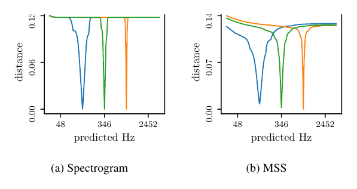
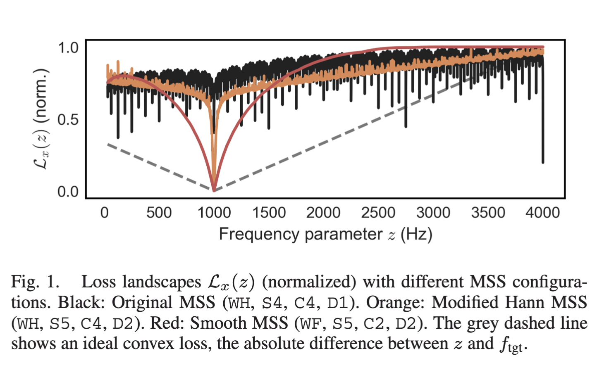
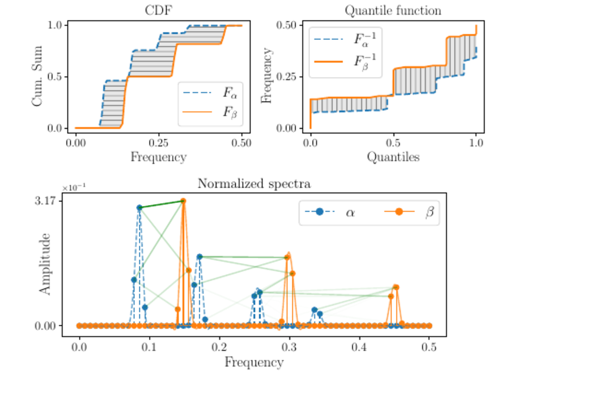
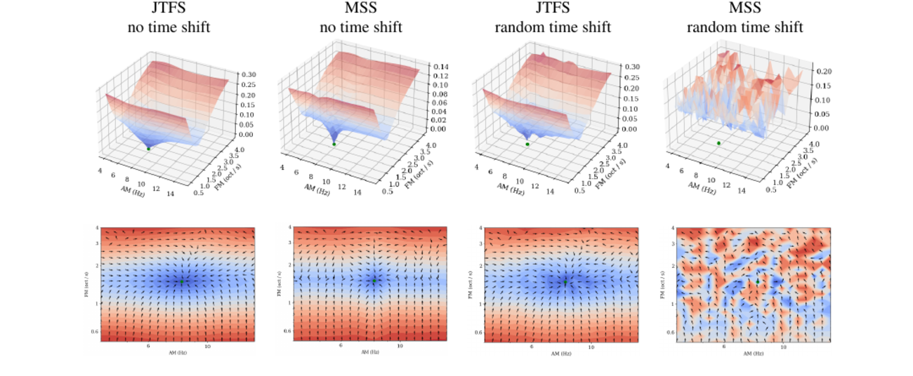

## Overview

::: {.incremental}
- Recap: physical models as differentiable audio synthesisers
- The Week 4 turnaround: from synthesis to learning
- Differentiable programming in JAX
- Gradients through loops, recursions, and simulators
- Audio losses: waveform, spectrum, and perceptual tradeoffs
- Mini task: fit a small differentiable audio model
- Practical problems: constraints, stability, and local minima
:::

# Recap: Physical Models as Programs

## What We Have Built So Far

$$
\text{physical parameters}
+
\text{excitation}
\quad
\longrightarrow
\quad
\text{simulator}
\quad
\longrightarrow
\quad
\text{sound}
$$

. . .

::: {.incremental}
- Week 1: physical models as state-space systems
- Week 2: modal and grid discretisations
- Week 3: nonlinear forces and coupled systems
:::

. . .

The common thread:

$$
\theta
\quad
\longrightarrow
\quad
\hat y
$$

Parameters go in. Audio comes out.

## The One Change in Week 3

Linear model:

$$
\text{inertia}
+
\text{damping}
+
\text{linear restoring force}
=
\text{external force}
$$

. . .

Week 3 added:

$$
\text{nonlinear force}
\quad
f_{\mathrm{nl}}(\mathbf q)
$$

. . .

So the model became:

$$
\text{linear dynamics}
+
f_{\mathrm{nl}}(\mathbf q)
=
\text{external force}
$$

. . .

For tension modulation:

$$
f_{\mathrm{nl},\mu}(\mathbf q)
\propto
\lambda_\mu^2 q_\mu
\sum_\nu
\lambda_\nu^2 q_\nu^2
$$

. . .

**The force now depends on the current (modal) state of the system.**

## The Week 4 Turnaround

So far:

$$
\theta
\quad
\longrightarrow
\quad
\hat y
$$

. . .

This week:

$$
\ell(\hat y, y)
\quad
\longrightarrow
\quad
J(\theta)=\ell(g(\theta),y)
\quad
\longrightarrow
\quad
\nabla_\theta J
\quad
\longrightarrow
\quad
\text{update } \theta
$$

. . .

The question changes:

$$
\text{Can we simulate this sound?}
\quad
\longrightarrow
\quad
\text{Can we learn the model from sound?}
$$

# Differentiable Programming for Audio

## A Differentiable Audio Synthesiser

Write the synthesiser as a function:

$$
\hat y = g(\theta)
$$

. . .

Choose a scalar signal-level loss that compares audio:

$$
\ell(\hat y, y)
$$

. . .

Composing it with the synthesiser gives a scalar objective as a function of parameters:

$$
J(\theta)
=
\ell\left(g(\theta), y\right)
$$

. . .

Then use automatic differentiation. For each parameter $\theta_i$, summing over audio samples $n$:

$$
\frac{\partial J}{\partial \theta_i}
=
\sum_n
\frac{\partial \ell}{\partial \hat y_n}
\frac{\partial \hat y_n}{\partial \theta_i}
$$

. . .

For a sinusoid, $\theta_i$ could be $A$, $\gamma$, $f$, or $\varphi$.

. . .

AD computes this chain rule through the synthesiser.

## A Tiny Differentiable Synthesiser

Start with one damped sinusoid:

$$
\hat y_n
=
A e^{-\gamma t_n}
\sin(2\pi f t_n + \varphi)
$$

. . .

The learnable parameters are:

$$
\theta
=
\left\{
A,
\gamma,
f,
\varphi
\right\}
$$

. . .

Notebook: `week04/notebooks/differentiable_sinusoidal_synth.py`

. . .

This revisits the Week 2 optional challenge: optimise the argument of `sin`.

. . .

Even this simple synthesiser is already a differentiable audio synthesiser.

## Fit It to a Target

Define a waveform loss between signals:

$$
\ell_{\mathrm{MSE}}(\hat y, y)
=
\frac{1}{N}
\sum_n
\left(
\hat y_n - y_n
\right)^2
$$

. . .

For this synthesiser, the optimisation objective is:

$$
J(\theta)
=
\ell_{\mathrm{MSE}}(g(\theta), y)
$$

. . .

Then update parameters using gradients:

$$
\theta
\leftarrow
\theta
-
\eta
\nabla_\theta J
$$

. . .

Here $\eta$ is the learning rate: the step size for each update.

. . .

Automatic differentiation gives the gradient: local direction **and** magnitude of sensitivity.

## Same Synth, Complex Recursion

The same oscillator dynamics can be advanced as a complex state:

$$
z^{n+1}
=
a z^n
$$

. . .

with pole and initial state

$$
a
=
e^{(-\gamma + i2\pi f)\Delta t},
\qquad
z^0
=
A e^{i(\varphi-\pi/2)}
$$

. . .

and the audio output is:

$$
\hat y_n
=
\operatorname{Re}\{z^n\}
$$

. . .

This is the same complex multiplication pattern from Week 3, now inside a loss function.

## Optimising One Frequency

<video src="animations/media/videos/complex_frequency_optimization/single_frequency_comparison.mp4" controls style="width: 100%; max-height: 82vh; display: block; margin: 0 auto;"></video>

## Differentiable Does Not Mean Easy

::: {.incremental}
- Frequency errors accumulate as **phase errors**.
- Waveform MSE creates many local minima.
- Initialisation changes the optimisation outcome.
- The loss function decides what "close" means.
:::

. . .

Automatic differentiation gives derivatives of the program we wrote, up to floating-point arithmetic.

. . .

It does not guarantee that the optimisation problem is easy.

## Keeping Poles Stable

The discrete recursion is stable when:

$$
z^{n+1}
=
a z^n,
\qquad
|a| < 1
$$

. . .

Instead of learning $a$ directly, learn an unconstrained complex parameter:

$$
p \in \mathbb C
$$

. . .

and squash it into the unit disk:

$$
a
=
h(p)
=
\begin{cases}
\dfrac{\tanh |p|}{|p|}p, & p \neq 0, \\
0, & p = 0.
\end{cases}
$$

. . .

Then:

$$
|a|
=
\tanh |p|
< 1
$$

## Continuous vs. Discrete Parameters

Continuous-time view:

$$
a
=
e^{(-\gamma+i2\pi f)\Delta t},
\qquad
\gamma \ge 0
$$

. . .

Discrete-time view:

$$
a = h(p),
\qquad
|a| < 1
$$

. . .

If needed, recover the derived continuous-time modal parameters:

$$
\gamma
=
-\frac{\log |a|}{\Delta t},
\qquad
f
=
\frac{\angle a}{2\pi\Delta t}
$$

. . .

From a discrete pole $a$, we can recover a modal frequency, but only up to discrete-time aliasing.

. . .

These are modal quantities derived from the physical model, not the physical parameters themselves.

## The JAX Pattern

```python
def synth(theta):
    return y_hat


def loss(theta):
    y_hat = synth(theta)
    return jnp.mean((y_hat - y_target) ** 2)


loss_value, grads = jax.value_and_grad(loss)(theta)

updates, opt_state = optimizer.update(grads, opt_state, theta)
theta = optax.apply_updates(theta, updates)
```

. . .

Once the synthesiser is a JAX function, the training loop looks like any other differentiable model.

# Audio Losses

## The Loss Is Part of the Model

The training loop contains two choices:

$$
\theta
\quad
\longrightarrow
\quad
\hat y
\quad
\longrightarrow
\quad
\ell(\hat y, y)
$$

. . .

This defines the parameter objective $J(\theta)=\ell(g(\theta),y)$.

. . .

::: {.incremental}
- the synthesiser decides what sounds are possible
- the loss decides what counts as "close"
- the gradient follows the loss, not our intention
:::

. . .

So changing the loss can change the optimisation problem as much as changing the model.

## Waveform Losses

The simplest losses compare samples.

MSE is the mean squared, or normalized squared L2, waveform loss:

$$
\ell_{\mathrm{MSE}}
=
\frac{1}{N}
\sum_n
\left(
\hat y_n - y_n
\right)^2
$$

. . .

$$
\ell_{\mathrm{L1}}
=
\frac{1}{N}
\sum_n
\left|
\hat y_n - y_n
\right|
$$

. . .

::: {.incremental}
- direct and easy to differentiate
- L1 is less dominated by large sample errors than MSE
- works well when the target is phase-aligned
- very sensitive to small frequency and **phase errors**
- creates the kind of local structure we just saw
:::

## Spectral Loss

:::: {.columns}

::: {.column width="48%"}
{width=100%}

::: {style="font-size: 0.55em;"}
Turian and Henry, 2020.
:::
:::

::: {.column width="52%"}
Compare short-time magnitude spectra:

$$
Y=\operatorname{STFT}(y),
\qquad
\hat Y=\operatorname{STFT}(\hat y)
$$

$t$ indexes time frames; $k$ indexes frequency bins.

$$
\ell_{\mathrm{mag}}
=
\frac{1}{N_t N_f}
\sum_{t,k}
\left(
|\hat Y_{t,k}| - |Y_{t,k}|
\right)^2
$$

This is less tied to sample alignment, but it still compares bins **coordinate by coordinate**.

For pitch, the gradient can be weak or misleading away from the target.
:::

::::

::: {style="font-size: 0.68em;"}
Turian and Henry, ["I'm Sorry for Your Loss: Spectrally-Based Audio Distances Are Bad at Pitch"](https://arxiv.org/abs/2012.04572), 2020.
:::

## Log Magnitude

Raw magnitude is dominated by the loudest bins.

. . .

Log magnitude compares spectral shape on a compressed scale:

$$
\ell_{\mathrm{log}\text{-}\mathrm{mag}}
=
\frac{1}{N_t N_f}
\sum_{t,k}
\left(
\log(\epsilon + |\hat Y_{t,k}|)
-
\log(\epsilon + |Y_{t,k}|)
\right)^2
$$

. . .

Quieter components now have more influence on the gradient.

## Multi-Resolution STFT Loss

:::: {.columns}

::: {.column width="57%"}
{width=100%}

::: {style="font-size: 0.55em;"}
Schwär and Müller, 2023.
:::
:::

::: {.column width="43%"}
Use several STFT settings:

$$
\ell_{\mathrm{MR}\text{-}\mathrm{STFT}}
=
\sum_m
\ell_{\mathrm{STFT}}^{(m)}
$$

::: {.incremental}
- short windows: attacks and local timing
- long windows: pitch and harmonic structure
- different hop sizes and windows give different gradients
:::
:::

::::

. . .

::: {style="font-size: 0.68em;"}
See Schwär and Müller, ["Multi-Scale Spectral Loss Revisited"](https://doi.org/10.1109/LSP.2023.3333205), IEEE Signal Processing Letters, 2023.
:::

## Spectral Optimal Transport Loss

:::: {.columns}

::: {.column width="58%"}
{width=100%}

::: {style="font-size: 0.55em;"}
Torres, Peeters, and Richard, 2024.
:::
:::

::: {.column width="42%"}
::: {style="font-size: 0.86em;"}
Instead of comparing each frequency bin independently:

$$
\ell_{\mathrm{SOT}}
=
\sum_t
W_p
\left(
\tilde S_{\hat y,t},
\tilde S_{y,t}
\right)
$$

Use normalized nonnegative spectral frames $\tilde S_{\cdot,t}$.

The loss measures **how far spectral energy moves**.

It can give useful gradients for pitch and harmonic displacement.
:::
:::

::::

::: {style="font-size: 0.65em;"}
Torres, Peeters, and Richard, ["Unsupervised Harmonic Parameter Estimation Using Differentiable DSP and Spectral Optimal Transport"](https://arxiv.org/abs/2312.14507), ICASSP 2024.
:::

## JTFS / Scattering Loss

{width=92% fig-align="center"}

::: {style="font-size: 0.55em;"}
Vahidi et al., 2023.
:::

. . .

$$
\ell_{\mathrm{JTFS}}
=
\left\|
\Phi_{\mathrm{JTFS}}(\hat y)
-
\Phi_{\mathrm{JTFS}}(y)
\right\|_2^2
$$

. . .

JTFS compares **spectrotemporal scattering features**: texture, articulation, and mesostructure rather than raw STFT bins.

::: {style="font-size: 0.65em;"}
Vahidi et al., ["Mesostructures: Beyond Spectrogram Loss in Differentiable Time-Frequency Analysis"](https://arxiv.org/abs/2301.10183), 2023. See also Muradeli et al., ["Differentiable Time-Frequency Scattering on GPU"](https://arxiv.org/abs/2204.08269), DAFx 2022.
:::

## Loss Takeaway

There is no neutral audio loss.

. . .

::: {.incremental}
- waveform loss is precise but phase-sensitive
- spectral magnitude losses are more tolerant but can still mislead pitch optimisation
- multi-resolution STFT losses combine several time-frequency views
- the loss and the parameterisation together shape the gradient landscape
:::

. . .

Next: use these losses to fit physical or modal model parameters.

# Learning Modal Parameters

## From One Oscillator to a Modal Synth

The one-oscillator example is the smallest modal synthesiser.

. . .

For a modal bank:

$$
z_\mu^{n+1}
=
a_\mu z_\mu^n
$$

with:

$$
a_\mu
=
e^{(-\gamma_\mu+i2\pi f_\mu)\Delta t}
$$

. . .

The output is a readout over modes:

$$
\hat y_n
=
\operatorname{Re}
\left\{
\sum_\mu
c_\mu z_\mu^n
\right\}
$$

. . .

Same idea, just more poles.

## What Can We Learn?

The parameter vector might contain:

$$
\theta
=
\{
f_\mu,
\gamma_\mu,
c_\mu,
z_\mu^0
\}
$$

. . .

::: {.incremental}
- modal frequencies
- modal damping rates
- readout gains
- initial modal amplitudes and phases
- excitation parameters
- nonlinear force parameters
:::

. . .

The modelling question becomes:

$$
\text{Which parameters should remain physical, and which should be learned freely?}
$$

## Vectorised Complex Recursion

For all modes at once:

$$
\mathbf z^{n+1}
=
\mathbf a \odot \mathbf z^n
$$

. . .

```python
def modal_step(z, _):
    y = jnp.real(jnp.sum(c * z))
    z_next = a * z
    return z_next, y


_, y_hat = jax.lax.scan(
    modal_step,
    init=z0,
    xs=None,
    length=n_steps,
)
```

. . .

`lax.scan` is just a loop, but JAX can differentiate through it.

## Differentiating Through Time

The loss depends on every output sample:

$$
J
=
\ell
\left(
\hat y_0,
\hat y_1,
\ldots,
\hat y_{N-1};
y
\right)
$$

. . .

Each output depends on all previous updates:

$$
z^n
=
a^n z^0
$$

. . .

For a real parameter $\alpha$ such as $f$ or $\gamma$, the gradient accumulates through time:

$$
\frac{\partial J}{\partial \alpha}
=
\sum_n
\frac{\partial \ell}{\partial \hat y_n}
\frac{\partial \hat y_n}{\partial z^n}
\frac{\partial z^n}{\partial \alpha}
$$

. . .

This is backpropagation through the simulator.

## When Gradients Get Too Long

Backpropagation through a simulator is still backpropagation through a long recurrent computation.

. . .

For a damped modal pole:

$$
a_\mu
=
e^{(-\gamma_\mu+i2\pi f_\mu)\Delta t}
$$

the sensitivity to the initial state scales like:

$$
\frac{\partial z_\mu^n}{\partial z_\mu^0}
=
a_\mu^n,
\qquad
|a_\mu|^n
=
e^{-\gamma_\mu n\Delta t}
$$

. . .

::: {.incremental}
- long damped sequences can kill late gradients
- unstable recursions can explode gradients
- full BPTT stores the whole unrolled simulation
- truncated BPTT is cheaper, but biased toward short dependencies
:::

. . .

::: {style="font-size: 0.68em;"}
See Sutskever, [*Training Recurrent Neural Networks*](https://www.cs.toronto.edu/~ilya/pubs/ilya_sutskever_phd_thesis.pdf), PhD thesis, University of Toronto, 2013.
:::

## A Practical Split

Start small:

::: {.incremental}
- learn frequencies and damping from a clean synthetic target
- keep the number of modes fixed
- keep excitation and readout simple
- constrain poles so the recursion stays stable
:::

. . .

Then increase difficulty:

::: {.incremental}
- unknown excitation
- noisy or recorded target audio
- too many or too few modes
- nonlinear forces
:::

## Mini Task: Fit a Differentiable Synth

Notebook: `week04/notebooks/differentiable_sinusoidal_synth.py`

. . .

Start with the small case:

$$
\theta
=
\{A,\gamma,f,\varphi\}
$$

. . .

Then inspect the complex-recursion version:

$$
z^{n+1}
=
a z^n
$$

. . .

Try:

::: {.incremental}
- changing the initial frequency
- changing the signal duration
- switching from waveform loss to spectral loss
- fitting one pole radius directly instead of fitting $\gamma$
:::

# Preview: Physical Parameters

## From Modal to Physical Parameters

::: {style="font-size: 0.84em;"}

Instead of learning each modal frequency independently:

$$
\theta
=
\{
f_\mu,
\gamma_\mu
\}_{\mu=1}^{M}
$$

learn a smaller physical set, assuming $\rho$ and $A_{\mathrm{cs}}$ are known:

$$
\theta
=
\{
T_0,
EI,
d_1,
d_3
\}
$$

The physical parameters generate the modal parameters.

For a stiff string:

$$
\omega_\mu^2
=
\frac{T_0}{\rho A_{\mathrm{cs}}}
\lambda_\mu^2
+
\frac{EI}{\rho A_{\mathrm{cs}}}
\lambda_\mu^4
$$

For damping:

$$
2\gamma_\mu
=
d_1
+
d_3\lambda_\mu^2
$$

So tension, stiffness, and damping are not isolated modal knobs. They shape whole frequency and decay-rate curves.

:::

## Point Estimates, Not Uncertainty

This week we mostly do point estimation:

$$
\hat\theta
=
\arg\min_\theta
J(\theta),
\qquad
J(\theta)=\ell(g(\theta),y)
$$

. . .

The optimiser returns one best-fit parameter vector:

$$
\hat\theta
$$

. . .

This is not the same as estimating a posterior distribution:

$$
\underbrace{\hat\theta}_{\text{point estimate}}
\qquad
\text{is not}
\qquad
\underbrace{p(\theta \mid y)}_{\text{posterior distribution}}
$$

. . .

Several parameter settings may explain the same sound nearly equally well.

. . .

Uncertainty and distribution estimation are for Week 9.

## Maximum Likelihood View

Assume the target was generated by:

$$
y
=
g(\theta)
+
\epsilon
$$

with independent Gaussian noise:

$$
\epsilon_n
\sim
\mathcal N(0,\sigma^2)
$$

. . .

Then maximum likelihood gives:

$$
\hat\theta_{\mathrm{MLE}}
=
\arg\min_\theta
\sum_n
\left(
y_n
-
\hat y_n(\theta)
\right)^2
$$

. . .

So minimising waveform MSE is equivalent to MLE under a simple noise model.

. . .

Other audio losses can be useful objectives, but they are not automatically simple likelihoods.

# Wrapping Up

## The Week 4 Loop

This week turned synthesis into estimation:

$$
\theta
\rightarrow
\hat y
\qquad
\text{became}
\qquad
y
\rightarrow
\hat\theta
$$

. . .

The practical loop is:

$$
\text{model}
\quad\rightarrow\quad
\text{loss}
\quad\rightarrow\quad
\text{gradient}
\quad\rightarrow\quad
\text{update}
\quad\rightarrow\quad
\text{checks}
$$

. . .

::: {.incremental}
- constrain parameters so the simulator remains stable
- choose a loss that matches the task: perception, parameters, or both
- initialise from signal knowledge when possible
- inspect the sound, spectrum, residual, and fitted parameters
:::

## What the Gradient Gives You

:::: {.columns}

::: {.column width="50%"}
### Gives

::: {.incremental}
- local sensitivity of the loss
- credit assignment through the simulator
- a direction for parameter updates
:::
:::

::: {.column width="50%"}
### Does Not Give

::: {.incremental}
- the correct physical model
- a globally optimal solution
- uncertainty about the answer
:::
:::

::::

. . .

Use the loss as a diagnostic: it can support an approximate fit, or expose a misleading landscape.

$$
g(\hat\theta) \approx y
\quad\not\Rightarrow\quad
\hat\theta = \theta_\text{true}
$$

## Takeaway

$$
\text{differentiable audio}
=
\text{differentiable audio synthesiser}
+
\text{loss}
+
\text{constraints}
$$

. . .

::: {.incremental}
- The loss defines what "close" means.
- Parameterisation shapes what the optimiser can safely change.
- AD gradients are derivatives of the implemented program, not magic for the inverse problem.
- Good inverse modelling is part optimisation, part physics, and part listening.
:::

. . .

Looking ahead: fit modal banks, physical parameters, excitation, nonlinear forces, and learned residuals.

Which parts should be physics, which parts should be learned, and how do we know?

## Resources

[**Sinusoidal frequency estimation by gradient descent**](https://ieeexplore.ieee.org/stamp/stamp.jsp?arnumber=10095188)

[**Fast differentiable modal simulation of non-linear strings, membranes, and plates**](https://arxiv.org/pdf/2505.05940)

[**A review of differentiable digital signal processing for music and speech synthesis**](https://arxiv.org/abs/2308.15422)

Differentiable audio synthesis / DDSP tutorial:

[intro2ddsp.github.io](https://intro2ddsp.github.io)
