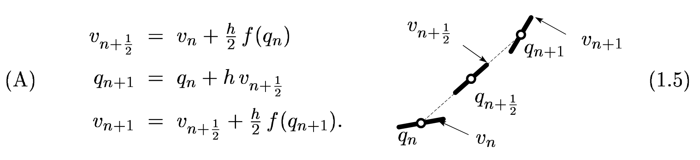

## Overview

::: {.incremental}
- Neural ODEs: differentiable solvers, trajectories, and audio-rate dynamics
- Hybrid physical-neural modal models: fit a linear backbone, then inspect a learned residual
:::

# Recap: Differentiable Audio Models

## The Week 4 Loop

Last week we wrote a synthesiser as a differentiable function:

$$
\theta
\quad\longrightarrow\quad
\hat y = g(\theta)
$$

. . .

Then we chose a loss:

$$
J(\theta)=\ell(\hat y,y)
$$

. . .

And used automatic differentiation:

$$
\nabla_\theta J
$$

to update the parameters.

## What Was Learnable?

In the simple sinusoidal example:

$$
\hat y(t)
=
A e^{-\gamma t}
\sin(2\pi f t+\varphi)
$$

. . .

the learnable quantities were:

$$
\theta=\{A,\gamma,f,\varphi\}
$$

. . .

In the modal case, we could learn:

::: {.incremental}
- modal frequencies $\omega_\mu$
- modal damping rates $\gamma_\mu$
- initial modal amplitudes
- readout weights
- physical parameters that generate the modal spectrum
:::

## What Was Still Fixed?

Even when the parameters were learnable, the **form of the model** was fixed.

. . .

For a linear modal system:

$$
\dot{\tilde{\mathbf q}}
=
\mathbf A\tilde{\mathbf q}
$$

. . .

For the nonlinear string:

$$
\ddot{\mathbf q}
=
-2\boldsymbol\Gamma\dot{\mathbf q}
-
\boldsymbol\Omega^2\mathbf q
-
\mathbf f_{\mathrm{nl}}(\mathbf q)
$$

. . .

The optimiser could change numbers inside the equations, but not the equation family itself.

# Recap: Continuous-Time State-Space Models

## The State-Space View

The common form underneath the course is:

$$
\dot{\mathbf h}(t)
=
\mathbf F(\mathbf h(t),t,f(t);\theta)
$$

. . .

where:

::: {.incremental}
- $\mathbf h(t)$ is the state
- $f(t)$ is the external force or excitation signal
- $\theta$ contains parameters
- $\mathbf F$ is the vector field: it says how the state changes
:::

. . .

The output is usually a readout:

$$
\hat y(t)=\mathbf C\mathbf h(t)
$$

This keeps the notation from Weeks 1--2: $f(t)$ is the driving signal, and $\mathbf C$ is the output map.

## From Physics to a Vector Field

For a modal second-order system:

$$
\ddot{\mathbf q}
=
-2\boldsymbol\Gamma\dot{\mathbf q}
-
\boldsymbol\Omega^2\mathbf q
+
\mathbf b f(t)
$$

. . .

Stack displacement and velocity directly:

$$
\frac{d}{dt}
\begin{bmatrix}
\mathbf q\\
\dot{\mathbf q}
\end{bmatrix}
=
\begin{bmatrix}
\mathbf 0 & \mathbf I\\
-\boldsymbol\Omega^2 & -2\boldsymbol\Gamma
\end{bmatrix}
\begin{bmatrix}
\mathbf q\\
\dot{\mathbf q}
\end{bmatrix}
+
\begin{bmatrix}
\mathbf 0\\
\mathbf b
\end{bmatrix}
f(t)
$$

This is a continuous-time state-space vector field with a fixed physical matrix.

## The Simulator

The computer never stores the whole continuous trajectory.

. . .

It solves the initial value problem:

$$
\mathbf h(t_0)=\mathbf h^0,
\qquad
\dot{\mathbf h}=\mathbf F(\mathbf h,t,f(t);\theta)
$$

. . .

and returns samples:

$$
\mathbf h^0,\mathbf h^1,\ldots,\mathbf h^N
\qquad
\text{where}
\qquad
\mathbf h^n\approx \mathbf h(t^n)
$$

. . .

The discrete recursion is an approximation to the continuous-time model.

## Revisiting the Pipeline

Week 4:

$$
\theta
\quad\longrightarrow\quad
\text{physical simulator}
\quad\longrightarrow\quad
\hat y
\quad\longrightarrow\quad
\ell(\hat y,y)
\quad\longrightarrow\quad
\nabla_\theta J
$$

. . .

Week 5:

$$
\text{physical dynamics}
\quad+\quad
\mathbf f_{\mathrm{nl},\theta}
\quad\longrightarrow\quad
\text{fixed-step solver}
\quad\longrightarrow\quad
\hat y
$$

. . .

The neural part lives inside the dynamics; the solver still turns those dynamics into an audio-rate recurrence.

# ODE Solvers as Differentiable Blocks

## The Solver Is Part of the Model

A continuous-time model is not executable until we choose a solver:

$$
\mathbf F
\qquad
\text{and}
\qquad
\text{a time-stepping rule}
$$

. . .

In this lecture we focus on **fixed-step solvers** on the audio grid:

$$
t^n=n\Delta t,
\qquad
n=0,\ldots,N
$$

. . .

The solver turns a continuous-time system into a recurrence:

$$
\mathbf h^{n+1}
=
\Phi_{\Delta t}
\left(
\mathbf h^n,
f^n
\right)
$$

. . .

For audio synthesis, the fixed grid matters because the model must return the whole trajectory.

. . .

Then the audio readout is:

$$
\hat y^n
=
\mathbf C\mathbf h^n
$$

. . .

Change the solver and you change the recurrence.

## Discretising a Vector Field

Start from any first-order ODE:

$$
\frac{d}{dt}\mathbf h(t)
=
\mathbf F(\mathbf h(t),t,f(t))
$$

. . .

On the fixed grid, a solver replaces the time derivative by a difference rule:

$$
\delta_t^{(\mathrm{solver})}\mathbf h^n
\approx
\mathbf F(\cdot)
$$

. . .

Here $\mathbf F$ is agnostic:

::: {.incremental}
- physical vector field
- neural vector field
- hybrid physical-neural vector field
:::

. . .

The choice of $\delta_t^{(\mathrm{solver})}$ determines the discrete recurrence.

## Fixed-Step Solver Examples {style="font-size: 0.68em;"}

Different solvers choose different discrete forms for $\delta_t^{(\mathrm{solver})}$.

. . .

**Forward Euler**

$$
\delta_{t,+}\mathbf h^n
:=
\frac{\mathbf h^{n+1}-\mathbf h^n}{\Delta t}
=
\mathbf F(\mathbf h^n,t^n,f^n)
$$

. . .

**Centred first difference / leapfrog**

$$
\delta_t\mathbf h^n
:=
\frac{\mathbf h^{n+1}-\mathbf h^{n-1}}{2\Delta t}
=
\mathbf F(\mathbf h^n,t^n,f^n)
$$

. . .

Other fixed-step solvers, such as Runge--Kutta methods, use additional evaluations of $\mathbf F$ inside each audio-grid step.

## For Oscillators: Use the Structure

For the modal systems we care about, the dynamics are naturally second order:

$$
\ddot{\mathbf q}
=
\text{acceleration}
$$

. . .

So instead of applying a generic first-order solver blindly, we use a scheme designed for second-order oscillators.

. . .

Why:

::: {.incremental}
- it keeps the displacement/velocity structure explicit
- it has better long-time behaviour for oscillatory systems
- it matches the centred finite-difference schemes from Weeks 1--2
:::

## Start With a Second-Order Oscillator

For one modal oscillator, or a diagonal bank of modes:

$$
\ddot{\mathbf q}
=
-2\boldsymbol\Gamma\dot{\mathbf q}
-
\boldsymbol\Omega^2\mathbf q
+
\mathbf b f(t)
$$

. . .

Generic ODE solvers evolve first-order systems. As in Week 1, stack displacement and velocity:

$$
\mathbf h
=
\begin{bmatrix}
\mathbf q\\
\dot{\mathbf q}
\end{bmatrix}
$$

. . .

Then the second-order oscillator becomes:

$$
\dot{\mathbf h}
=
\begin{bmatrix}
\dot{\mathbf q}\\
-2\boldsymbol\Gamma\dot{\mathbf q}
-
\boldsymbol\Omega^2\mathbf q
+
\mathbf b f(t)
\end{bmatrix}
$$

. . .

This first-order vector field is what a generic ODE solver advances.

## Finite Difference Operators

From Week 1, the centred time-difference operators are:

$$
\begin{aligned}
\delta_t q^n
&=
\frac{q^{n+1}-q^{n-1}}{2\Delta t}
\\[0.4em]
\delta_{tt} q^n
&=
\frac{q^{n+1}-2q^n+q^{n-1}}{\Delta t^2}
\end{aligned}
$$

. . .

The first approximates velocity; the second approximates acceleration.

## Störmer-Verlet

Start from the damped second-order oscillator:

$$
\ddot{\mathbf q}
=
-2\boldsymbol\Gamma\dot{\mathbf q}
-
\boldsymbol\Omega^2\mathbf q
+
\mathbf b f(t)
$$

. . .

The acceleration is **not** just a function of $\mathbf q$: the damping term depends on velocity.

. . .

Apply the centred operators directly to the second-order equation:

$$
\delta_{tt}\mathbf q^n
=
-2\boldsymbol\Gamma\,\delta_t\mathbf q^n
-
\boldsymbol\Omega^2\mathbf q^n
+
\mathbf b f^n
$$

. . .

Here $\delta_t\mathbf q^n$ is a velocity estimate from displacement samples, not an independent velocity state.

## Expand the Differences

Expand the finite-difference operators:

$$
\frac{\mathbf q^{n+1}-2\mathbf q^n+\mathbf q^{n-1}}{\Delta t^2}
=
-2\boldsymbol\Gamma
\frac{\mathbf q^{n+1}-\mathbf q^{n-1}}{2\Delta t}
-
\boldsymbol\Omega^2\mathbf q^n
+
\mathbf b f^n
$$

. . .

Because the damping term uses a centred velocity estimate, $\mathbf q^{n+1}$ appears on both sides. The next slide solves this linear relation.

## Solve for the Next Sample {style="font-size: 0.72em;"}

Starting from the expanded equation:

$$
\frac{\mathbf q^{n+1}-2\mathbf q^n+\mathbf q^{n-1}}{\Delta t^2}
=
-2\boldsymbol\Gamma
\frac{\mathbf q^{n+1}-\mathbf q^{n-1}}{2\Delta t}
-
\boldsymbol\Omega^2\mathbf q^n
+
\mathbf b f^n
$$

. . .

Collect the unknown $\mathbf q^{n+1}$ terms:

$$
(\mathbf I+\Delta t\,\boldsymbol\Gamma)\mathbf q^{n+1}
=
(2\mathbf I-\Delta t^2\boldsymbol\Omega^2)\mathbf q^n
-
(\mathbf I-\Delta t\,\boldsymbol\Gamma)\mathbf q^{n-1}
+
\Delta t^2\mathbf b f^n
$$

. . .

With $\mathbf R=(\mathbf I+\Delta t\,\boldsymbol\Gamma)^{-1}$:

$$
\boxed{
\mathbf q^{n+1}
=
\mathbf R(2\mathbf I-\Delta t^2\boldsymbol\Omega^2)\mathbf q^n
-
\mathbf R(\mathbf I-\Delta t\,\boldsymbol\Gamma)\mathbf q^{n-1}
+
\Delta t^2\mathbf R\mathbf b f^n
}
$$

. . .

This is the same two-step modal recursion from Week 2. In modal coordinates, $\boldsymbol\Gamma$ is diagonal, so $\mathbf R$ is elementwise.

## Two-Step State-Space Matrix {style="font-size: 0.68em;"}

Stack two consecutive displacement samples:

$$
\mathbf h^n
=
\begin{bmatrix}
\mathbf q^n\\
\mathbf q^{n-1}
\end{bmatrix},
\qquad
\mathbf h^{n+1}
=
\begin{bmatrix}
\mathbf q^{n+1}\\
\mathbf q^n
\end{bmatrix}
$$

. . .

Then the centred-difference scheme is a discrete state-space recursion:

$$
\mathbf h^{n+1}
=
\mathbf A_\Delta \mathbf h^n
+
\mathbf b_\Delta f^n
$$

$$
\mathbf A_\Delta
=
\begin{bmatrix}
\mathbf R(2\mathbf I-\Delta t^2\boldsymbol\Omega^2)
&
-\mathbf R(\mathbf I-\Delta t\,\boldsymbol\Gamma)
\\
\mathbf I
&
\mathbf 0
\end{bmatrix},
\qquad
\mathbf b_\Delta
=
\begin{bmatrix}
\Delta t^2\mathbf R\mathbf b\\
\mathbf 0
\end{bmatrix}
$$

. . .

For a displacement readout:

$$
\hat y^n
=
\mathbf C_\Delta\mathbf h^n,
\qquad
\mathbf C_\Delta
=
\begin{bmatrix}
\mathbf C_q & \mathbf 0
\end{bmatrix}
$$

## If We Want Velocity as a State

Start again from the centred-difference formulation:

$$
\delta_{tt}\mathbf q^n
=
-2\boldsymbol\Gamma\,\delta_t\mathbf q^n
-
\boldsymbol\Omega^2\mathbf q^n
+
\mathbf b f^n
$$

. . .

The two-step version represents both $\delta_t\mathbf q^n$ and $\delta_{tt}\mathbf q^n$ using only displacement samples.

. . .

The centred velocity at time $n$ is

$$
\mathbf v^n
:=
\delta_t\mathbf q^n
=
\frac{\mathbf q^{n+1}-\mathbf q^{n-1}}{2\Delta t}.
$$

. . .

To keep velocity as a state, factor those same centred operators through half-step velocities:

$$
\mathbf v^{n+\frac12}
=
\frac{\mathbf q^{n+1}-\mathbf q^n}{\Delta t},
\qquad
\mathbf v^{n-\frac12}
=
\frac{\mathbf q^n-\mathbf q^{n-1}}{\Delta t}
$$

. . .

These half-step velocities are intermediate quantities. The stored state will be the integer-time pair $[\mathbf q^n,\mathbf v^n]^\top$.

## Velocity Verlet Half-Step

:::: {.columns}

::: {.column width="42%"}

If velocity is available at the integer time $n$, construct the half-step velocity with a half kick:

$$
\mathbf v^{n+\frac12}
=
\mathbf v^n
+
\frac{\Delta t}{2}\mathbf a^n
$$

The integer time position and integer time velocity are related by a half step:

$$
\begin{align*}
\mathbf q^{n+1} &= \mathbf q^n + \Delta t\, \mathbf v^{n+\frac{1}{2}}\\
\mathbf v^{n+1} &= \mathbf v^{n+\frac{1}{2}} + \frac{\Delta t}{2}\mathbf a^{n+1}
\end{align*}
$$

:::

::: {.column width="58%"}

{width="112%" fig-align="center"}

::: {style="font-size: 0.55em;"}
Source: Hairer et al., *Geometric numerical integration illustrated by the Störmer-Verlet method*.
:::

:::

::::

## Damped Velocity Verlet

Start from the same two updates:

$$
\begin{align*}
\mathbf q^{n+1} &= \mathbf q^n + \Delta t\, \mathbf v^{n+\frac{1}{2}}\\
\mathbf v^{n+1} &= \mathbf v^{n+\frac{1}{2}} + \frac{\Delta t}{2}\mathbf a^{n+1}
\end{align*}
$$

. . .

For the damped oscillator at time $n$ and $n+1$:

$$
\begin{align*}
\mathbf a^n &= -2\boldsymbol\Gamma\mathbf v^n - \boldsymbol\Omega^2\mathbf q^n + \mathbf b f^n\\
\mathbf a^{n+1} &= -2\boldsymbol\Gamma\mathbf v^{n+1} - \boldsymbol\Omega^2\mathbf q^{n+1} + \mathbf b f^{n+1}
\end{align*}
$$

. . .

Because $\mathbf a^{n+1}$ depends on $\mathbf v^{n+1}$, the final half kick is implicit.

## Solving the Final Half Kick {style="font-size: 0.72em;"}

Substitute the damped acceleration into the final half kick:

$$
\mathbf v^{n+1}
=
\mathbf v^{n+\frac12}
+
\frac{\Delta t}{2}
\left(
-2\boldsymbol\Gamma\mathbf v^{n+1}
-
\boldsymbol\Omega^2\mathbf q^{n+1}
+
\mathbf b f^{n+1}
\right)
$$

. . .

Move the unknown velocity terms to the left:

$$
\mathbf v^{n+1}
+
\Delta t\,\boldsymbol\Gamma\mathbf v^{n+1}
=
\mathbf v^{n+\frac12}
-
\frac{\Delta t}{2}\boldsymbol\Omega^2\mathbf q^{n+1}
+
\frac{\Delta t}{2}\mathbf b f^{n+1}
$$

. . .

Factor $\mathbf v^{n+1}$:

$$
(\mathbf I+\Delta t\,\boldsymbol\Gamma)\mathbf v^{n+1}
=
\mathbf v^{n+\frac12}
-
\frac{\Delta t}{2}\boldsymbol\Omega^2\mathbf q^{n+1}
+
\frac{\Delta t}{2}\mathbf b f^{n+1}
$$

. . .

The $\mathbf I$ appears because $\mathbf v^{n+1}=\mathbf I\mathbf v^{n+1}$.

$$
\mathbf v^{n+1}
=
(\mathbf I+\Delta t\,\boldsymbol\Gamma)^{-1}
\left[
\mathbf v^{n+\frac12}
-
\frac{\Delta t}{2}\boldsymbol\Omega^2\mathbf q^{n+1}
+
\frac{\Delta t}{2}\mathbf b f^{n+1}
\right]
$$

## Velocity Verlet State-Space Form {style="font-size: 0.56em;"}

Define the integer-time state and helper matrices:

$$
\mathbf h^n
=
\begin{bmatrix}
\mathbf q^n\\
\mathbf v^n
\end{bmatrix},
\qquad
\mathbf P=\mathbf I-\Delta t\,\boldsymbol\Gamma,
\qquad
\mathbf Q=\mathbf I-\frac{\Delta t^2}{2}\boldsymbol\Omega^2,
\qquad
\mathbf R=(\mathbf I+\Delta t\,\boldsymbol\Gamma)^{-1}
$$

. . .

Then velocity Verlet gives a one-step recursion:

$$
\mathbf h^{n+1}
=
\mathbf A_{\mathrm{vv}}\mathbf h^n
+
\mathbf b_0 f^n
+
\mathbf b_1 f^{n+1}
$$

$$
\mathbf A_{\mathrm{vv}}
=
\begin{bmatrix}
\mathbf Q
&
\Delta t\,\mathbf P
\\[0.3em]
-\frac{\Delta t}{2}\mathbf R\boldsymbol\Omega^2(\mathbf I+\mathbf Q)
&
\mathbf R\!\left(\mathbf P-\frac{\Delta t^2}{2}\boldsymbol\Omega^2\mathbf P\right)
\end{bmatrix}
$$

$$
\mathbf b_0
=
\begin{bmatrix}
\frac{\Delta t^2}{2}\mathbf b\\[0.3em]
\mathbf R\!\left(\frac{\Delta t}{2}\mathbf b-\frac{\Delta t^3}{4}\boldsymbol\Omega^2\mathbf b\right)
\end{bmatrix},
\qquad
\mathbf b_1
=
\begin{bmatrix}
\mathbf 0\\[0.3em]
\frac{\Delta t}{2}\mathbf R\mathbf b
\end{bmatrix}
$$

. . .

The extra $f^{n+1}$ term comes from the final half kick.

# Neural ODEs

## Neural ODE: Definition

A Neural ODE parameterises the vector field with a neural network:

$$
\dot{\mathbf h}(t)
=
\mathbf F_\theta(\mathbf h(t),t,f(t))
$$

. . .

The trajectory is defined implicitly by integration:

$$
\mathbf h(t_1)
=
\mathbf h(t_0)
+
\int_{t_0}^{t_1}
\mathbf F_\theta(\mathbf h(t),t,f(t))\,dt
$$

. . .

The neural network does not output the next state directly.

. . .

It outputs the **instantaneous rate of change**, also called the vector field.

. . .

The solver integrates this vector field to produce the **flow** from $\mathbf h(t_0)$ to $\mathbf h(t_1)$.

. . .

In this course, we usually evaluate that flow with a **fixed-step solver** on the audio grid.

## Neural ODE vs. Discrete RNN

:::: {.columns}

::: {.column width="50%"}
### Residual RNN

$$
\mathbf h^{n+1}
=
\mathbf h^n
+
\Delta t\,
\mathbf G_\theta(\mathbf h^n,f^n)
$$

- learns the residual update on the grid
- has the same form as a forward Euler step
- tied to the chosen $\Delta t$
- one network call per step
- natural when the data are sampled sequences
:::

::: {.column width="50%"}
### Neural ODE

$$
\dot{\mathbf h}
=
\mathbf F_\theta(\mathbf h,t,f(t))
$$

Forward Euler gives:

$$
\mathbf h^{n+1}
=
\mathbf h^n
+
\Delta t\,
\mathbf F_\theta(\mathbf h^n,t^n,f^n)
$$

- learns the continuous-time vector field
- the solver turns it into a recurrence
- with Euler, it resembles a residual RNN cell
:::

::::

## Where Does the Learning Happen?

Both produce a recurrence on the audio grid. The difference is where the learnable object lives:

. . .

$$
\text{learn } \mathbf G_\theta
\qquad
\text{or}
\qquad
\text{learn } \mathbf F_\theta \text{ and discretise it with } \Phi_{\Delta t}
$$

. . .

For audio, arbitrary-time evaluation is not the main selling point. We usually need the full trajectory on a fixed sample grid:

$$
t^n=n\Delta t,
\qquad
n=0,\ldots,N
$$

## Why This Fits Physical Modelling

Physical modelling already starts from:

$$
\dot{\mathbf h}
=
\mathbf F_{\mathrm{phys}}(\mathbf h,t,f(t);\phi)
$$

. . .

Neural ODEs let us replace this with:

$$
\dot{\mathbf h}
=
\mathbf F_\theta(\mathbf h,t,f(t))
$$

. . .

or, more usefully for this course:

$$
\dot{\mathbf h}
=
\mathbf F_{\mathrm{phys}}(\mathbf h,t,f(t);\phi)
+
\mathbf f_{\mathrm{nl},\theta}(\mathbf h,t,f(t))
$$

. . .

The network learns a residual force, not the whole instrument from scratch.

## Three Modelling Choices

:::: {.columns}

::: {.column width="33%"}
### Pure physics

$$
\dot{\mathbf h}
=
\mathbf F_{\mathrm{phys}}(\mathbf h)
$$

Interpretable, structured, but incomplete.
:::

::: {.column width="33%"}
### Pure Neural ODE

$$
\dot{\mathbf h}
=
\mathbf F_\theta(\mathbf h)
$$

Flexible, but weak physical guarantees.
:::

::: {.column width="33%"}
### Hybrid

$$
\dot{\mathbf h}
=
\mathbf F_{\mathrm{phys}}(\mathbf h)+\mathbf f_{\mathrm{nl},\theta}(\mathbf h)
$$

Structured baseline plus learned correction.
:::

::::

. . .

For sound synthesis, the hybrid case is often the most useful starting point.

## Three Choices in State-Space Form {style="font-size: 0.52em;"}

Let the known physical acceleration be:

$$
\mathbf A_{\mathrm{phys}}
=
\begin{bmatrix}
\mathbf 0 & \mathbf I\\
-\boldsymbol\Omega^2 & -2\boldsymbol\Gamma
\end{bmatrix},
\qquad
\mathbf b_{\mathrm{phys}}
=
\begin{bmatrix}
\mathbf 0\\
\mathbf b
\end{bmatrix}
$$

. . .

:::: {.columns}

::: {.column width="33%"}
### Pure physics

$$
\frac{d}{dt}
\begin{bmatrix}
\mathbf q\\
\dot{\mathbf q}
\end{bmatrix}
=
\mathbf A_{\mathrm{phys}}
\begin{bmatrix}
\mathbf q\\
\dot{\mathbf q}
\end{bmatrix}
+
\mathbf b_{\mathrm{phys}}f(t)
$$
:::

::: {.column width="33%"}
### Pure neural

$$
\frac{d}{dt}
\begin{bmatrix}
\mathbf q\\
\dot{\mathbf q}
\end{bmatrix}
=
\mathbf F_\theta(\mathbf q,\dot{\mathbf q},f(t))
$$
:::

::: {.column width="33%"}
### Hybrid

$$
\frac{d}{dt}
\begin{bmatrix}
\mathbf q\\
\dot{\mathbf q}
\end{bmatrix}
=
\mathbf A_{\mathrm{phys}}
\begin{bmatrix}
\mathbf q\\
\dot{\mathbf q}
\end{bmatrix}
+
\mathbf b_{\mathrm{phys}}f(t)
+
\begin{bmatrix}
\mathbf 0\\
\mathbf f_{\mathrm{nl},\theta}(\mathbf q,\dot{\mathbf q},f(t))
\end{bmatrix}
$$
:::

::::

## What Can the Network Represent?

A residual can learn:

::: {.incremental}
- unknown restoring forces
- missing damping
- mode coupling
- truncation or discretisation error
- latent excitation effects
:::

. . .

Only what the data and loss make identifiable.

## Where the Prior Enters

The physical part decides the default behaviour:

::: {.incremental}
- which modes exist
- their approximate frequencies
- their approximate damping
- how excitation enters
- how the readout is formed
:::

. . .

The neural residual only needs to explain the mismatch:

$$
\text{target}
-
\text{physical model}
$$

. . .

That is usually easier than learning the whole system from audio.

## If the Acceleration Is Neural

Instead of changing the solver, change the acceleration law:

$$
\mathbf a^n
\quad\longrightarrow\quad
\mathbf a_\theta(\mathbf q^n, f^n)
$$

. . .

For example:

$$
\ddot{\mathbf q}
=
\mathbf a_\theta(\mathbf q, f(t))
$$

. . .

The update structure stays the same: Störmer-Verlet / velocity Verlet still provides the recurrence on the audio grid.

. . .

The learnable object lives inside the acceleration term, not in a new discrete update map.

## Fixed-Step Verlet Pattern

```python
def acceleration(params, q, force):
    return a_theta(params, q, force)


def verlet_step(params, state, force_n, force_np1, dt):
    q, v = state
    a_n = acceleration(params, q, force_n)
    v_half = v + 0.5 * dt * a_n
    q_next = q + dt * v_half
    a_next = acceleration(params, q_next, force_np1)
    v_next = v_half + 0.5 * dt * a_next
    return (q_next, v_next)
```

. . .

This is the same solver block as before; only `acceleration` is learned.

## Scanning Through Time

```python
def step(state, inputs):
    force_n, force_np1 = inputs
    state_next = verlet_step(params, state, force_n, force_np1, dt)
    y_next = readout(state_next)
    return state_next, y_next


state_final, y_hat = jax.lax.scan(
    step,
    init=(q0, v0),
    xs=(force[:-1], force[1:]),
)
```

. . .

Unrolled over time, the solver is still a differentiable recurrence.

## Adaptive Solvers

Many Neural ODE papers use adaptive solvers.

. . .

They choose internal step sizes based on an error estimate:

$$
\Delta t
\quad\text{changes during the solve}
$$

. . .

Advantages:

::: {.incremental}
- fewer steps when the dynamics are slow
- more steps when the dynamics are fast
- separates internal solver steps from requested output samples
:::

. . .

For audio-rate synthesis, adaptive solvers are not needed: we still need every output sample.

## Audio-Rate Constraint

At $44.1$ kHz, one second of audio has:

$$
44100
$$

output samples.

. . .

Even if the solver uses internal steps, the model still has to produce the full output trajectory:

$$
\hat y_0,\hat y_1,\ldots,\hat y_N
$$

. . .

If the solver evaluates the neural acceleration $m$ times per output sample:

$$
m \times 44100
$$

network evaluations are needed for one second.

. . .

For training, this is expensive. This is why we train on short slices of audio.

# Training Neural ODEs

## State Loss in the Notebook

In `learn_modal_nonlinearity.py`, the target is simulated, so we know the modal state:

$$
\mathbf h^n
=
\begin{bmatrix}
\mathbf q^n\\
\mathbf v^n
\end{bmatrix}
$$

. . .

The notebook compares normalized displacement and velocity:

$$
\ell_{\mathrm{state}}
=
\mathrm{mean}
\left[
\left(
\frac{\hat{\mathbf q}-\mathbf q}{s_q}
\right)^2
\right]
+
\mathrm{mean}
\left[
\left(
\frac{\hat{\mathbf v}-\mathbf v}{s_v}
\right)^2
\right]
$$

. . .

This is not an audio-only loss: the audio readout is mainly for listening and checks.

. . .

With real recordings, we usually do **not** get $\mathbf q$ and $\mathbf v$.

. . .

Then the loss must move to the readout:

$$
y^n
=
\mathbf C\mathbf h^n
$$

or to a waveform / spectral objective.

## Audio Loss

With an audio recording:

$$
\hat y^n
=
\mathbf C\hat{\mathbf h}^n
$$

. . .

and:

$$
\ell_{\mathrm{audio}}
=
\ell(\hat y,y)
$$

. . .

The gradient must pass through:

$$
\text{loss}
\quad\rightarrow\quad
\text{readout}
\quad\rightarrow\quad
\text{solver}
\quad\rightarrow\quad
\mathbf F_\theta
$$

. . .

This is powerful, but much harder than fitting observed trajectories.

## One-Step Derivative Loss

If clean trajectories are available, we can estimate derivatives:

$$
\dot{\mathbf h}^n
\approx
\frac{\mathbf h^{n+1}-\mathbf h^n}{\Delta t}
$$

. . .

Then train the vector field directly:

$$
\ell_{\mathrm{deriv}}
=
\frac{1}{N}
\sum_n
\left\|
\mathbf F_\theta(\mathbf h^n,t^n,f^n)
-
\dot{\mathbf h}^n
\right\|^2
$$

. . .

This is simpler than backpropagating through a long rollout.

. . .

But finite-difference derivative targets can be noisy.

## Windowed Rollout Loss

The notebook does not backpropagate through the full one-second clip on every update.

. . .

Instead it samples random windows:

$$
s_k
\sim
\mathrm{Uniform}\{0,\ldots,N-L\}
$$

with:

$$
L = 10\text{ ms} = 441\text{ samples},
\qquad
K = 8\text{ windows}
$$

. . .

Each window starts from the target state:

$$
\hat{\mathbf q}_{s_k:s_k+L},
\hat{\mathbf v}_{s_k:s_k+L}
=
\mathrm{Solve}
(\mathbf q_{s_k},\mathbf v_{s_k},\mathbf f_{s_k:s_k+L})
$$

. . .

Then we average the normalized state error over windows:

$$
\ell_{\mathrm{win}}
=
\frac{1}{K}
\sum_{k=1}^K
\ell_{\mathrm{state}}^{(k)}
$$

. . .

This keeps the graph short while still training simulation behaviour.

. . .

The full one-second rollout is for listening and open-loop checks.

## Backpropagating Through Time

For a fixed-step solver, the most direct approach is:

$$
\text{differentiate through every solver step}
$$

. . .

This is what JAX does when the solve is written with differentiable operations.

. . .

Pros:

::: {.incremental}
- simple to understand
- matches the implemented discrete solver
- works well for moderate sequence lengths
:::

. . .

Cons:

::: {.incremental}
- memory grows with trajectory length
- gradients can explode, vanish, or become misleading
- long audio signals make the graph very large
:::

## The Continuous Adjoint Idea

Neural ODEs are often associated with the adjoint method.

. . .

Define the adjoint sensitivity:

$$
\boldsymbol\lambda(t)
=
\frac{\partial J}{\partial \mathbf h(t)}
$$

. . .

It evolves backward in time:

$$
\frac{d\boldsymbol\lambda}{dt}
=
-
\boldsymbol\lambda^\top
\frac{\partial \mathbf F_\theta}{\partial \mathbf h}
$$

. . .

The gradient with respect to $\theta$ is accumulated during this backward solve.

. . .

This can reduce memory, but introduces another numerical solve.

## Adjoint Caveat

The continuous adjoint differentiates the continuous problem.

. . .

The program we run differentiates a **discretised** problem.

. . .

These are not always identical:

$$
\nabla
\left(
\text{discretise then optimise}
\right)
\neq
\nabla
\left(
\text{optimise continuous system}
\right)
$$

. . .

For audio and stiff oscillatory systems, the numerical details matter.

. . .

Use adjoints when they help, but do not treat them as magic.

# Hybrid Physical-Neural Sound Models

## Learn the Missing Force

Recall the physical acceleration we already know:

$$
\ddot{\mathbf q}
=
-2\boldsymbol\Gamma\dot{\mathbf q}
-
\boldsymbol\Omega^2\mathbf q
+
\mathbf b f(t)
$$

. . .

If the model is missing nonlinear physics, the true acceleration may be:

$$
\ddot{\mathbf q}
=
-2\boldsymbol\Gamma\dot{\mathbf q}
-
\boldsymbol\Omega^2\mathbf q
+
\mathbf b f(t)
+
\mathbf f_{\mathrm{nl,true}}(\mathbf q,\dot{\mathbf q},f(t))
$$

. . .

A hybrid model keeps the known acceleration and learns the extra force:

$$
\ddot{\mathbf q}
=
-2\boldsymbol\Gamma\dot{\mathbf q}
-
\boldsymbol\Omega^2\mathbf q
+
\mathbf b f(t)
+
\mathbf f_{\mathrm{nl},\theta}(\mathbf q,\dot{\mathbf q},f(t))
$$

. . .

The neural term represents the missing nonlinear force, not the whole dynamics.

## Neural Force in the State Equation

Write the state equation without introducing a new symbol:

$$
\frac{d}{dt}
\begin{bmatrix}
\mathbf q\\
\dot{\mathbf q}
\end{bmatrix}
=
\begin{bmatrix}
\mathbf 0 & \mathbf I\\
-\boldsymbol\Omega^2 & -2\boldsymbol\Gamma
\end{bmatrix}
\begin{bmatrix}
\mathbf q\\
\dot{\mathbf q}
\end{bmatrix}
+
\begin{bmatrix}
\mathbf 0\\
\mathbf b
\end{bmatrix}
f(t)
+
\begin{bmatrix}
\mathbf 0\\
\mathbf f_{\mathrm{nl},\theta}(\mathbf q,\dot{\mathbf q},f(t))
\end{bmatrix}
$$

. . .

The network is forced to behave like an additional force term from unresolved nonlinearities.

## Structure Matters

A completely free network can learn nonphysical behaviour:

::: {.incremental}
- energy creation
- unstable damping
- impossible coupling
- dependence on unobserved variables
- poor extrapolation outside the training range
:::

. . .

Physical structure reduces the space of bad solutions.

. . .

It does not remove the need for checks.

## Stable Parameterisations

Common tactics:

::: {.incremental}
- learn damping through a positive map such as `softplus`
- multiply residuals by a small scale at initialisation
- constrain learned matrices to be dissipative
- use bounded activations for force residuals
- penalise energy growth in the loss
- start from short rollouts, then increase horizon
:::

. . .

The same theme as Week 4:

$$
\text{differentiable}
\neq
\text{automatically stable}
$$

## Notebook Activity: Diagnose a Residual Fit

The code already:

::: {.incremental}
- simulates a modal oscillator with a known nonlinear force
- hides the nonlinear force from the fitted model
- fits a constrained linear modal backbone
- fine-tunes the backbone with a residual MLP
:::

. . .

The activity is to compare three cases:

$$
\text{linear}
\qquad
\text{linear + learned residual}
\qquad
\text{true nonlinear}
$$

. . .

Listen, plot trajectories, inspect the learned residual, and decide what the fit explains.

## Notebook Training Choice

:::: {.columns}

::: {.column width="50%"}
### Linear stage

- train constrained modal parameters
- no neural residual yet
- objective: same random-window state loss
- result: best linear approximation to nonlinear target
:::

::: {.column width="50%"}
### Joint stage

- initialise from the linear fit
- train modal parameters and residual MLP together
- objective: same random-window state loss
- result: physical backbone plus learned restoring-force correction
:::

::::

. . .

Derivative matching is an alternative, but not the path used in this notebook.

## What to Inspect

Do not trust the scalar loss alone.

. . .

Inspect:

::: {.incremental}
- random-window loss curve
- full-second open-loop readout
- readout residual
- first modal trajectories
- learned residual against the hidden-force reference
- exported audio for linear, target, and joint models
:::

. . .

The last step is important: a low window loss can still sound wrong in a full rollout.

# Practical Problems

## Stiffness

Audio physical models are often stiff:

$$
\text{fast high-frequency modes}
\quad
\text{and}
\quad
\text{slow low-frequency decay}
$$

. . .

Stiff systems force explicit solvers to use very small time steps.

. . .

In modal synthesis, the high modes may dominate the numerical step-size constraint even when they are perceptually quiet.

. . .

Truncation, damping, and solver choice interact.

## Solver Choice Is a Modelling Choice

For this course, ask:

::: {.incremental}
- Does the solver preserve the qualitative behaviour?
- Does it remain stable at the audio sample rate?
- Is it differentiable in the way we need?
- Is it fast enough for training?
- Is it fast enough for synthesis?
:::

. . .

The best solver mathematically may be too expensive for the musical task.

## Sampling and Observation

The ODE state is continuous-time.

. . .

Audio is sampled:

$$
\hat y^n
=
\mathbf C\mathbf h(n\Delta t)
$$

. . .

Training only sees the sampled output.

. . .

If two different trajectories produce similar samples or spectra, the inverse problem may not identify the true dynamics.

## State Observability

From a single audio channel:

$$
y^n
=
\mathbf c^\top\mathbf q^n
$$

. . .

many modal states can produce similar outputs.

. . .

Learning a vector field from audio alone is therefore underconstrained.

. . .

Helpful additions:

::: {.incremental}
- known modal basis
- multiple readout positions
- known excitation
- state measurements from simulation
- physics-informed penalties
:::

## Generalisation

A useful synthesiser should work beyond the training clip.

. . .

Test:

::: {.incremental}
- new initial amplitudes
- new excitation strengths
- longer rollouts
- unseen pitch or parameter settings
- different sampling rates, if the model claims continuous-time behaviour
:::

. . .

Continuous-time notation does not guarantee continuous-time generalisation.

# Looking Toward PINNs

## Neural ODEs vs. PINNs

:::: {.columns}

::: {.column width="50%"}
### Neural ODE

Learn or correct the vector field:

$$
\dot{\mathbf h}
=
\mathbf F_\theta(\mathbf h,t,f(t))
$$

The solver enforces the dynamics during rollout.
:::

::: {.column width="50%"}
### PINN

Learn a function and penalise equation residuals:

$$
\mathcal R_\theta
=
\partial_t w_\theta
-
\mathcal L w_\theta
$$

The loss encourages the solution to satisfy the PDE.
:::

::::

## The Bridge

Neural ODEs ask:

$$
\text{What vector field generated this trajectory?}
$$

. . .

PINNs ask:

$$
\text{What function satisfies this differential equation and data?}
$$

. . .

Both use automatic differentiation.

. . .

They put the physics in different places.

## Week 5 Takeaway

Neural ODEs make the dynamics learnable:

$$
\dot{\mathbf h}
=
\mathbf F_\theta(\mathbf h,t,f(t))
$$

. . .

For physical audio, the most useful form is often:

$$
\dot{\mathbf h}
=
\mathbf F_{\mathrm{phys}}(\mathbf h,t,f(t);\phi)
+
\mathbf f_{\mathrm{nl},\theta}(\mathbf h,t,f(t))
$$

. . .

::: {.incremental}
- keep the physics you trust
- learn the part you do not know
- treat the solver as part of the model
- inspect stability, energy, and generalisation
- do not expect audio loss alone to identify the true dynamics
:::

## Resources

**Neural ODEs**

- Chen, Rubanova, Bettencourt, Duvenaud, ["Neural Ordinary Differential Equations"](https://arxiv.org/abs/1806.07366), 2018.
- Kidger, *On Neural Differential Equations*, 2022.
- Kidger, ["Diffrax: numerical differential equation solvers in JAX"](https://github.com/patrick-kidger/diffrax).

**Hybrid physical-neural dynamics**

- Rackauckas et al., ["Universal Differential Equations for Scientific Machine Learning"](https://arxiv.org/abs/2001.04385), 2020.
- Greydanus, Dzamba, Yosinski, ["Hamiltonian Neural Networks"](https://arxiv.org/abs/1906.01563), 2019.
- Cranmer et al., ["Lagrangian Neural Networks"](https://arxiv.org/abs/2003.04630), 2020.
