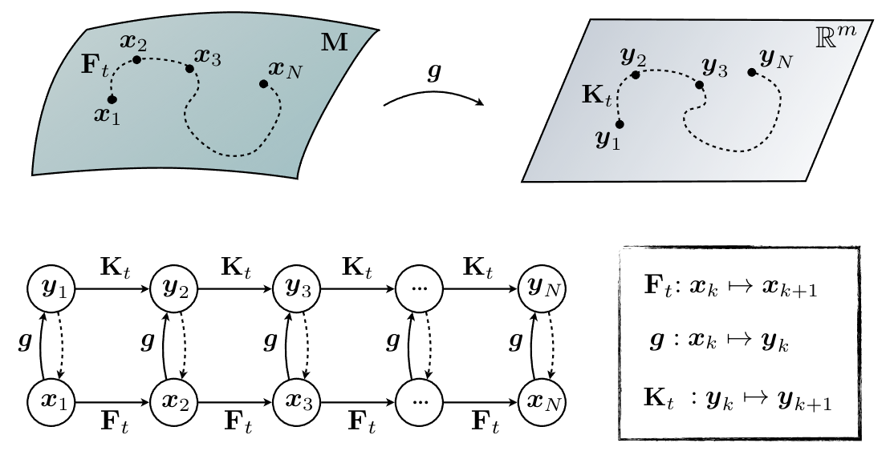
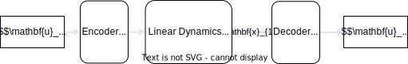
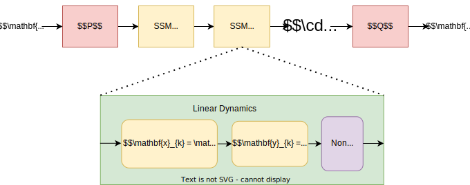

## Overview

::: {.incremental}
- Recap: state-space models as the common language of the course
- From learned solution maps to learned time evolution
- Koopman view: nonlinear dynamics through linear evolution of observables
- Deep Koopman networks: autoencoders with linear latent dynamics
- Deep state-space models: learnable SSM layers for long audio sequences
- Stability, energy behaviour, and long sound-producing rollouts
- Bridge to parameter estimation and final projects
:::

# From Operators Back To Dynamics

## Week 7 Recap

Neural operators learn a family-level map:

$$
G: \text{problem setup} \rightarrow \text{solution field}.
$$

. . .

For a short trajectory, this can be useful:

$$
a \rightarrow u(x,t).
$$

. . .

But synthesis often wants a **causal recurrence**:

$$
h_n \rightarrow h_{n+1} \rightarrow h_{n+2} \rightarrow \cdots
$$

## The Week 8 Question

Weeks 1--7 used several state choices:

::: {.incremental}
- physical coordinates: displacement, velocity, pressure
- modal coordinates: independent or coupled resonators
- neural ODE states: learned vector fields
- PINN coordinates: direct space-time functions
- operator inputs and outputs: discretised functions
:::

. . .

This week asks:

$$
\text{Can we learn a state where the dynamics become simpler?}
$$

## Latent State-Space Form

A learned state-space model usually has three pieces:

$$
x_n \xrightarrow{E_\theta} z_n \xrightarrow{F_\theta} z_{n+1} \xrightarrow{D_\theta} \hat{x}_{n+1}.
$$

. . .

With forcing or controls:

$$
z_{n+1} = F_\theta(z_n, u_n).
$$

. . .

For sound synthesis, `u_n` might be a pluck, bowing input, hammer force, breath pressure, gesture signal, or control parameter.

## Why Nonlinear Evolution Is Expensive

A general nonlinear transition gives a sequential computation:

$$
z_N = F_\theta(F_\theta(\cdots F_\theta(z_0,u_0) \cdots,u_{N-2}),u_{N-1}).
$$

. . .

Each future state depends on the previous network output, so rollout cost grows with the number of audio samples.

. . .

If the latent evolution were linear,

$$
z_{n+1} = A z_n + B u_n,
$$

then many samples could be evaluated efficiently with matrix powers, convolutions, or parallel scans.

## Three Ways To Learn Dynamics

::: {.incremental}
- **Neural ODE:** learn a nonlinear vector field on the chosen state, then step
  it on the fixed audio time grid used for synthesis.

  $$
  \dot{x} = f_\theta(x,u,t)
  $$

- **Deep Koopman:** learn observables where the latent evolution is linear.

  $$
  z_n = E_\theta(x_n), \qquad z_{n+1} = K_\theta z_n
  $$

- **Deep SSM:** learn an efficient linear recurrence or convolution inside a
  deep sequence model.

  $$
  z_{n+1} = A_\theta z_n + B_\theta u_n, \qquad y_n = C_\theta z_n
  $$
:::

. . .

The contrast is where the model puts the difficult part: in the nonlinear
evolution, in the learned coordinates, or in the input/output mixing around a
linear sequence layer.

# Koopman View

## Linearizing the Nonlinear

{fig-alt="Koopman schematic showing nonlinear dynamics in state space and linear dynamics in observable space" width="82%"}

**The Koopman idea:** instead of analyzing a system only in its native state space, lift it to a possibly high-dimensional **observable space** where the dynamics are linear.

$$
g(x_{k+1}) = (K g)(x_k)
$$

## Nonlinear Dynamics

Start with a discrete nonlinear system:

$$
x_{n+1} = f(x_n).
$$

. . .

The trajectory may be complicated in the original coordinates:

$$
x_n = \text{displacement, velocity, pressure, modal amplitudes, or audio features}.
$$

. . .

Koopman theory changes the object of study from states to **observables** of the state.

## Observables

Choose functions:

$$
g_1(x), \ldots, g_K(x)
$$

and collect them as:

$$
z = g(x).
$$

. . .

The Koopman idea is that nonlinear state evolution can sometimes look more linear after lifting:

$$
z_{n+1} \approx K z_n.
$$

. . .

The nonlinearity moves into the representation.

## Deep Koopman Networks

How do we find the observable functions `g`?

. . .

The space of all possible observables is infinite-dimensional.

. . .

Deep Koopman networks use an autoencoder-like architecture:

$$
z_n = E_\theta(x_n), \qquad z_{n+1} = K_\theta z_n, \qquad \hat{x}_{n+1} = D_\theta(z_{n+1}).
$$

. . .

The encoder learns observables; the latent matrix enforces simple dynamics; the decoder maps back to the physical or audio domain.

## Deep Koopman Architecture

{fig-alt="Deep Koopman architecture with encoder, linear latent dynamics, and decoder" width="82%"}

. . .

Typical losses combine:

::: {.incremental}
- reconstruction of the initial state
- prediction of future states
- consistency between encoded states and linear latent rollout
:::

## Training Objective

For a trajectory $x_0, \ldots, x_L$ and learned observable map $\varphi$:

$$
\begin{aligned}
\mathcal{L}_{\text{consistency}}
&= \sum_{k=1}^{L-1}\left\|\varphi(x_k)-\Lambda^k\varphi(x_0)\right\|_2^2 \\
\mathcal{L}_{\text{pred}}
&= \sum_{k=1}^{L-1}\left\|x_k-\varphi^{-1}\left(\Lambda^k\varphi(x_0)\right)\right\|_2^2 \\
\mathcal{L}_{\text{enc}}
&= \left\|x_0-\varphi^{-1}\left(\varphi(x_0)\right)\right\|_2^2 \\
\mathcal{L}
&= \alpha_1\mathcal{L}_{\text{pred}} + \alpha_2\mathcal{L}_{\text{enc}} + \alpha_3\mathcal{L}_{\text{consistency}}.
\end{aligned}
$$

## Koopman and Modal Analysis

### For linear systems, such as an ideal string

::: {.incremental}
- Koopman **eigenfunctions** behave like modal coordinates.
- Koopman **eigenvalues** represent modal frequencies and damping.
- The readout reconstructs displacement, velocity, pressure, or audio from those modal coordinates.
:::

### For nonlinear systems

We try to find learned resonator-like coordinates that account for coupling, amplitude-dependent frequencies and pitch glide.

## Deep Koopman: Summary and Challenges

::: {.incremental}
- **Core idea:** an autoencoder transforms nonlinear dynamics into linear evolution in a latent space.
- **Application:** modal-like synthesis for nonlinear systems.
- **Strength:** fast rollouts and potentially interpretable eigenvalues/modes.
- **Challenge:** finding useful observables can require lots of data and careful initialisation.
- **Audio caveat:** small latent frequency or damping errors are audible over long rollouts.
:::

# Deep State Space Models

## Deep State Space Models: Core Idea

Start from the classic continuous-time linear time-invariant system:

$$
\begin{aligned}
\dot{x}(t) &= A x(t) + B u(t) \\
y(t) &= C x(t) + D u(t).
\end{aligned}
$$

. . .

A **deep state-space model** uses this form as a learnable neural network layer.

. . .

The matrices `A`, `B`, `C`, and sometimes `D` are no longer fixed from a hand-derived physical model; they are parameters learned from data.

## Linear Is Not Diagonal

The recurrence is **linear in the state** when it has the form:

$$
x_k = \bar{A}x_{k-1} + \bar{B}u_k.
$$

. . .

This can be true whether $\bar{A}$ is dense, structured, block diagonal, or
diagonal.

. . .

Diagonal is an extra structural restriction:

$$
\bar{A} = \operatorname{diag}(\lambda_1,\ldots,\lambda_N).
$$

. . .

::: {.incremental}
- **S4:** linear recurrence, but not a simple diagonal `A`; it used a structured state matrix and specialised kernel computation.
- **DSS and S4D:** kept the recurrence linear and made diagonal `A` matrices work well.
- **LRU:** used diagonal linear recurrences inside a deeper neural block.
:::

. . .

So the layer can use a linear recurrence, the matrix can optionally be diagonal,
and the full DSSM can still be nonlinear because of projections, gating,
normalisation, nonlinearities, and depth.

## DSSM Family Evolution {.compact-table}

| Model | Main idea |
| :--- | :--- |
| **S4 (2021)** | Structured NPLR `A`, HiPPO memory, and fast convolution-kernel computation. |
| **DSS (2022)** | Complex diagonal `A`; removes the low-rank term. |
| **S4D (2022)** | Diagonal SSM with HiPPO-derived initialisation. |
| **S5 (2022)** | MIMO SSM with a shared state matrix and parallel scan. |
| **LRU (2023)** | Discrete diagonal linear RNN with polar parameterisation for stability. |

## DSSM Layer

::: {.light-figure}
{fig-alt="Deep state-space model diagram showing input, state transition, and output projection" width="100%"}
:::

. . .

When `A` is diagonal or block diagonal, the layer resembles a bank of learned resonators.

. . .

This analogy is strongest for one structured layer. Once layers are stacked with
mixing and nonlinearities, the full model is no longer just learned modal
synthesis.

## Discretisation

For sampled audio, the continuous system is converted to a discrete recurrence:

$$
\begin{aligned}
x_k &= \bar{A} x_{k-1} + \bar{B} u_k \\
y_k &= \bar{C} x_k.
\end{aligned}
$$

. . .

Here `u_k` is the input sample or feature at time `k`, `x_k` is the hidden state, and `y_k` is the output sample or feature.

. . .

This is a linear RNN with a very specific structure.

## Recurrence View

The recurrent representation is useful for **auto-regressive inference**:

$$
x_k = \bar{A}x_{k-1} + \bar{B}u_k.
$$

::: {.incremental}
- consumes one sample or block at a time
- keeps a compact hidden state
- fits real-time streaming synthesis
- makes control inputs natural
:::

. . .

This is the deployment view: step the model forward as audio is generated.

## Convolution View

Because the system is linear and time-invariant, the output can also be written as a convolution with an impulse response:

$$
h_k = \bar{C}\bar{A}^{k}\bar{B}.
$$

. . .

Then the sequence output is:

$$
y = h * u.
$$

. . .

This makes training on long sequences efficient: apply the convolution in parallel, often using FFTs or parallel scan algorithms.

## Why DSSMs Work Well For Long Audio

Audio has long dependencies:

::: {.incremental}
- resonances decay over thousands of samples
- room, body, and string responses have long memory
- musical gestures evolve over many time scales
- sample-level autoregressive networks can be expensive
:::

. . .

A structured state-space layer stores long memory in a compact state instead of recomputing it through a generic recurrent network.

## Relation To Modal Synthesis

A modal resonator bank can be written as:

$$
z_{k+1}^{(m)} = \lambda_m z_k^{(m)} + b_m u_k,
\qquad
\hat{y}_k = \sum_m c_m z_k^{(m)}.
$$

. . .

A DSSM generalizes this idea:

::: {.incremental}
- many learned modes or state channels
- learned input and output projections
- stable parameterisations for long memory
- nonlinear mixing between structured linear layers
:::

. . .

For sound, this suggests a path from hand-designed resonators to trainable resonator-like sequence models.

## DSSMs In Neural Architectures

A practical DSSM block is usually more than one linear recurrence.

::: {.incremental}
- input projection or embedding
- state-space kernel or recurrent update
- gating or pointwise nonlinearity
- output projection
- residual connection and normalisation
:::

. . .

The SSM provides long memory; the surrounding neural layers provide expressivity.

## Deep State Space Models: Summary and Challenges

::: {.incremental}
- Learn long-memory sequence layers with recurrence and convolution views.
- Efficient for long sequences, and streamable at inference time.
- Practical caveats: parameterisation, stability, and real-time deployment cost.
:::

# Audio Modelling Concerns

## Why This Matters For Sound

Audio synthesis is unforgiving because rollout errors are heard over many thousands of steps.

::: {.incremental}
- small phase errors become beating and detuning
- small energy errors become exploding or dying resonances
- unstable latent dynamics can produce unusable audio
- poor input handling breaks playability and control
- black-box latent states can be hard to edit musically
:::

## Useful Structure

Deep latent dynamics become more useful when the transition is constrained:

::: {.incremental}
- diagonal or block-diagonal transitions for modal structure
- stable eigenvalues for bounded rollouts
- input matrices for controllable excitation
- residual nonlinear terms for weak coupling
- energy or passivity losses for physical behaviour
- decoder constraints for interpretable outputs
:::

## Koopman vs DSSM

| Question | Deep Koopman | Deep State Space Model |
| :--- | :--- | :--- |
| What is learned? | observable coordinates plus linear latent dynamics | sequence layer parameters and projections |
| Where is the linearity? | in the lifted latent space | inside each SSM layer |
| Typical use | learn modal-like coordinates for a dynamical system | model long sequences efficiently |
| Audio intuition | nonlinear modal analysis | trainable resonator/filter bank with deep mixing |
| Main risk | poor observables or unstable eigenvalues | initialisation, parameter count, deployment cost |

## Course Connection

The model can be read as a learned version of earlier ingredients:

| Earlier course idea | Week 8 version |
| :--- | :--- |
| modal basis $\phi_m$ | learned encoder or input projection |
| modal recursion | latent transition $F_\theta$, $K_\theta$, or $\bar{A}$ |
| readout matrix $C$ | decoder or output projection |
| nonlinear coupling | latent residual, gating, or stacked layers |
| differentiable fitting | end-to-end training through rollout or convolution |

## Week 8 Takeaway

Deep state-space models learn:

$$
\text{representation} + \text{latent dynamics} + \text{readout}.
$$

. . .

Koopman-style models add a strong bias:

$$
\text{nonlinear observations} \rightarrow \text{approximately linear latent evolution}.
$$

. . .

DSSMs add a complementary bias:

$$
\text{structured recurrence} \leftrightarrow \text{efficient convolution}.
$$

. . .

For physical modelling, the key question is not only whether the model predicts the next frame. It is whether it remains stable, controllable, and meaningful over long sound-producing rollouts.

## Resources

- Brunton et al. (2016), Koopman invariant subspaces and finite linear representations of nonlinear dynamical systems for control: <https://doi.org/10.1371/journal.pone.0150171>
- Brunton, Budišić, Kaiser, and Kutz (2022), Modern Koopman theory for dynamical systems: <https://doi.org/10.1137/21M1401243>
- Lusch, Kutz, and Brunton (2018), Deep learning for universal linear embeddings of nonlinear dynamics: <https://doi.org/10.1038/s41467-018-07210-0>
- Gu et al. (2022), Efficiently Modeling Long Sequences with Structured State Spaces: <https://arxiv.org/abs/2111.00396>
- Gupta, Gu, and Berant (2022), Diagonal State Spaces are as Effective as Structured State Spaces: <https://arxiv.org/abs/2203.14343>
- Gu, Gupta, Goel, and Ré (2022), On the Parameterization and Initialization of Diagonal State Space Models: <https://arxiv.org/abs/2206.11893>
- Goel et al. (2022), It's Raw! Audio Generation with State-Space Models: <https://proceedings.mlr.press/v162/goel22a.html>
- Orvieto et al. (2023), Resurrecting Recurrent Neural Networks for Long Sequences: <https://proceedings.mlr.press/v202/orvieto23a.html>
- Smith et al. (2023), Simplified State Space Layers for Sequence Modeling: <https://arxiv.org/abs/2208.04933>
- De La Vega Martin, Diaz, and Sandler (2025), Evaluation of Neural Surrogates for Physical Modelling Synthesis of Nonlinear Elastic Plates, ICML25 ML for Audio workshop
