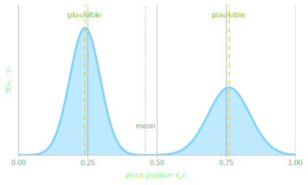

## Overview

::: {.incremental}
- From differentiable synthesis to inverse modelling
- Point estimates, likelihoods, and audio losses
- Modal parameters, physical parameters, and excitation parameters
- Why inverse problems are often ambiguous
- Distribution estimation with conditional discrete normalizing flows
- Notebook: infer pluck position from modal gains
:::

::: {.notes}
The emphasis is parameter estimation: what can be inferred from sound, what
cannot, and how to report ambiguity instead of hiding it behind one fitted
value.
:::

# From Synthesis To Estimation

## The Forward Problem

Weeks 1--7 mostly started from a model and generated sound:

$$
\theta
\quad\longrightarrow\quad
g(\theta)
\quad\longrightarrow\quad
\hat y.
$$

. . .

Here:

::: {.incremental}
- $\theta$ are physical, modal, excitation, readout, or neural parameters
- $g$ is the implemented simulator
- $\hat y$ is the predicted audio or observation
:::

. . .

This week we keep the simulator modal and focus on the inverse problem.

## The Inverse Problem

This week we reverse the question:

$$
y
\quad\longrightarrow\quad
\hat\theta.
$$

. . .

Given a target sound:

$$
y \approx g(\theta),
$$

estimate the parameters that could have produced it.


## Week 4 Loop, Revisited

Week 4 introduced the differentiable fitting loop:

$$
\theta
\rightarrow
\hat y
\rightarrow
\ell(\hat y,y)
\rightarrow
\nabla_\theta \ell
\rightarrow
\text{update}.
$$

. . .

This week adds two questions:

::: {.incremental}
- Which parameters are actually identifiable from this observation?
- Should the output be one best parameter vector or a distribution?
:::

## What Are We Estimating?

In a modal string model, possible unknowns include:

::: {.incremental}
- **modal parameters:** $f_\mu$, $\gamma_\mu$, gains, phases
- **physical parameters:** tension, stiffness, damping coefficients
- **excitation parameters:** pluck position, force shape, onset, amplitude
- **observation choices:** pickup position, gain, delay, filtering
:::

. . .

Different choices give different inverse problems.

## Free Modal Parameters

The most direct audio fit treats each mode separately:

$$
y(t)
=
\sum_{\mu=1}^{M}
g_\mu
e^{-\gamma_\mu t}
\cos(\omega_\mu t+\varphi_\mu).
$$

. . .

Then:

$$
\theta
=
\{
g_\mu,\gamma_\mu,\omega_\mu,\varphi_\mu
\}_{\mu=1}^{M}.
$$

. . .

This can reconstruct a signal well, but it may not explain the instrument.

## Physical Parameters

A physical parameterisation ties many modes together.

For a stiff string:

$$
\omega_\mu^2
=
\tau\lambda_\mu^2
+
B\lambda_\mu^4.
$$

. . .

where

$$
\tau =
\frac{T_0}{\rho A_{\mathrm{cs}}},
\qquad
B =
\frac{EI}{\rho A_{\mathrm{cs}}}.
$$

. . .

For damping:

$$
2\gamma_\mu
=
d_1
+
d_3\lambda_\mu^2.
$$

. . .

Now:

$$
\theta
=
\{
\tau, B, d_1, d_3
\}.
$$

. . .

Fewer parameters, stronger structure, harder optimisation.

## Excitation Parameters

For a plucked string, the initial modal displacement depends on the pluck:

$$
q_\mu^0
\propto
A
\frac{L}{L-x_p}
\frac{\sin(k_\mu x_p)}{k_\mu x_p}
\frac{1}{k_\mu}.
$$

. . .

The observed modal contribution also depends on the pickup:

$$
g_\mu
\approx
c_\mu(x_{\mathrm{out}})
q_\mu^0(x_p,A).
$$

. . .

So pluck position changes the whole modal-gain pattern.

## A Useful But Dangerous Shortcut

If the modal frequencies are known, we can summarise the observation with modal gains:

$$
y_\mu
=
\log
\left(
|c_\mu q_\mu^0|
+
\epsilon
\right)
+ \eta_\mu.
$$

. . .

This is what the conditional-flow notebook uses.

. . .

It is useful because it isolates the excitation-position problem.

. . .

It is dangerous because it throws away the sign of each real modal gain.

# Point Estimation

## Optimisation View

The simplest estimator returns one parameter vector:

$$
\hat\theta
=
\arg\min_\theta
J(\theta),
\qquad
J(\theta)
=
\ell(g(\theta),y).
$$

. . .

This is a **point estimate**.

. . .

It answers:

$$
\text{Which single parameter vector minimises my chosen objective?}
$$

## Maximum Likelihood View

Here $y=(y_1,\ldots,y_T)$ is one observed signal trajectory.

The index $t$ denotes a waveform sample.

. . .

Assume each sample is generated by:

$$
y_t
=
g_t(\theta)
+
\epsilon_t,
\qquad
\epsilon_t
\sim
\mathcal N(0,\sigma^2)
\quad
\text{independently over }t.
$$

. . .

Then the likelihood of the whole trajectory is:

$$
p(y\mid\theta)
=
\prod_{t=1}^{T}
p(y_t\mid\theta)
\propto
\exp
\left(
-
\frac{1}{2\sigma^2}
\|y-g(\theta)\|_2^2
\right).
$$

. . .

Maximising likelihood is equivalent to minimising waveform MSE.

## Audio Losses Are Not Automatically Likelihoods

Waveform MSE has a simple likelihood story.

. . .

Other losses may be better for sound:

::: {.incremental}
- magnitude STFT loss
- log-magnitude STFT loss
- multi-resolution STFT loss
- spectral optimal transport
- scattering-style losses
:::

. . .

But they are not automatically the log likelihood of an obvious noise model.

. . .

They are objectives, not neutral measurements of truth.

## MAP Estimation

If we add prior knowledge:

$$
p(\theta),
$$

we can estimate:

$$
\hat\theta_{\mathrm{MAP}}
=
\arg\max_\theta
p(\theta\mid y).
$$

. . .

Using Bayes:

$$
p(\theta\mid y)
\propto
p(y\mid\theta)
p(\theta).
$$

. . .

Equivalently:

$$
\hat\theta_{\mathrm{MAP}}
=
\arg\min_\theta
\left[
-\log p(y\mid\theta)
-\log p(\theta)
\right].
$$

## Priors As Physical Constraints

Priors can encode basic physical knowledge:

::: {.incremental}
- tension and stiffness are positive
- damping should not create energy
- pluck position lies inside the string
- gain should stay in a plausible range
- implausible parameter ranges should be penalised
:::

. . .

In implementation, we often optimise unconstrained variables:

$$
\theta_{\mathrm{uncon}} \in \mathbb R^d
$$

and map them to physical values:

$$
\theta
=
\operatorname{constrain}(\theta_{\mathrm{uncon}}).
$$

## Point Estimation Workflow

::: {.incremental}
1. Choose which parameters are unknown.
2. Choose a parameterisation that keeps them physical.
3. Choose the observation and loss.
4. Initialise from signal knowledge when possible.
5. Optimise.
6. Check audio, spectra, parameters, and residuals separately.
:::

. . .

The scalar loss is not enough.

## What A Good Fit Does Not Prove

A low loss can mean:

::: {.incremental}
- the true parameters were recovered
- the wrong parameters sound similar
- gain, delay, or alignment absorbed model error
- the loss ignored a perceptually or physically important mismatch
- the model family is wrong, but flexible enough to compensate
:::

. . .

$$
g(\hat\theta) \approx y
\quad\not\Rightarrow\quad
\hat\theta = \theta_{\mathrm{true}}.
$$

# Identifiability

## Identifiability Question

The central inverse-problem question:

$$
g(\theta_1)
\approx
g(\theta_2)
\quad
\Rightarrow
\quad
\theta_1
\approx
\theta_2
?
$$

. . .

If not, the parameters are not identifiable from this observation.

. . .

The problem may still be useful for synthesis.

. . .

It is just not a reliable measurement of the underlying physics.

## Parameter Symmetries

A parameter symmetry is a transformation that leaves the observation unchanged:

$$
S:\theta \mapsto S(\theta),
\qquad
g(S(\theta)) = g(\theta).
$$

. . .

Then $\theta$ and $S(\theta)$ cannot be distinguished from this observation.

. . .

With noise, finite clips, or compressed features, we often get approximate symmetries:

$$
g(S(\theta)) \approx g(\theta).
$$

. . .

Symmetry is one source of non-identifiability, but missing information can also make parameters unidentifiable.

## Physical Parameter Symmetry

Symmetries can appear before we even model the excitation.

. . .

For a simply-supported rectangular plate:

$$
\omega_{m,n}^2
=
\frac{D}{\rho h}
\left[
\pi^2
\left(
\frac{m^2}{L_x^2}
+
\frac{n^2}{L_y^2}
\right)
\right]^2.
$$

. . .

Swapping the side lengths and modal indices leaves the frequency set unchanged:

$$
(L_x,L_y,m,n)
\mapsto
(L_y,L_x,n,m).
$$

. . .

So from an unordered modal spectrum alone, width and length may be exchangeable.

. . .

Measurements tied to known plate coordinates can break this symmetry, for example
an excitation or pickup at a known $(x,y)$ location.

## Modal Sources Of Ambiguity

::: {.incremental}
- A pluck near a modal node weakly excites that mode.
- Pickup position can hide modes that were physically present.
- Overall gain trades against excitation amplitude.
- Short clips make slow decay rates hard to estimate.
- Noisy high modes blur stiffness and damping effects.
- Phase, delay, and onset errors can dominate waveform loss.
:::

## Example: Missing Harmonics

The pluck controls modal amplitudes:

$$
q_\mu^0(x_p,A).
$$

. . .

The readout controls what we observe:

$$
c_\mu(x_{\mathrm{out}}).
$$

. . .

If either term is near zero:

$$
|c_\mu q_\mu^0| \approx 0,
$$

that mode carries little information about the parameters.

## Example: Left/Right Symmetry

For an ideal string, sine modes have spatial symmetry:

$$
\sin
\left(
\mu\pi
\frac{L-x}{L}
\right)
=
(-1)^{\mu+1}
\sin
\left(
\mu\pi
\frac{x}{L}
\right).
$$

. . .

If we observe only magnitudes:

$$
|g_\mu|,
$$

some left/right information can be weakened or lost.

. . .

The posterior may have more than one plausible region.

## One Number Cannot Show This

A point estimator must choose one:

$$
\hat x_p.
$$

. . .

But the evidence may support several explanations:

$$
x_p
\in
\{0.2L, 0.8L\}
\quad
\text{or}
\quad
x_p \in [0.18L,0.28L].
$$

. . .

This motivates distribution estimation.

# Distribution Estimation

## Posterior Distribution

:::: {.columns}
::: {.column width="45%"}

Instead of one best value, estimate:

$$
p(\theta\mid y).
$$

. . .

This answers:

$$
\text{Which regions of parameter space plausibly explain the sound?}
$$

:::

::: {.column width="55%"}

{width=92% fig-align="center"}

:::
::::

## What The Posterior Can Show

For a modal sound, that region may be:

::: {.incremental}
- narrow for well-observed modal frequencies
- broad for poorly observed damping
- multimodal for ambiguous excitation positions
- correlated between excitation position and amplitude
:::

## Gaussian Estimator

A neural estimator can output mean and variance:

$$
\mathrm{NN}_\phi(y)
\longrightarrow
\mu_\phi(y),
\sigma_\phi(y).
$$

. . .

Then:

$$
q_\phi(\theta\mid y)
=
\mathcal N
\left(
\mu_\phi(y),
\operatorname{diag}(\sigma_\phi^2(y))
\right).
$$

. . .

This is simple and useful.

. . .

But it struggles with multimodal or curved posteriors.

## Why A Gaussian Can Mislead

Suppose both positions are plausible:

$$
x_p \approx 0.2L
\qquad
\text{or}
\qquad
x_p \approx 0.8L.
$$

. . .

A single Gaussian may report:

$$
\mu \approx 0.5L.
$$

. . .

But $0.5L$ may not be a plausible pluck position for the target.

. . .

The mean can be physically misleading.

## Conditional Normalizing Flow

A conditional flow represents:

$$
q_\phi(\theta\mid y)
$$

with an invertible transformation.

. . .

Sample:

$$
z
\sim
\mathcal N(0,I),
\qquad
\theta_{\mathrm{uncon}}
=
f_\phi(z;c_y),
\qquad
\theta
=
\operatorname{constrain}(\theta_{\mathrm{uncon}}).
$$

. . .

Here $f_\phi$ is the learned invertible flow map.

. . .

The variable $\theta_{\mathrm{uncon}}$ is the unconstrained coordinate version
of the physical parameter vector $\theta$.

. . .

The final $\operatorname{constrain}$ step maps unconstrained coordinates into
physical parameter ranges; it is not the string tension.

. . .

Here $c_y$ is the conditioning vector computed from the observation:

$$
c_y
=
\mathrm{encoder}_\phi(y).
$$

## Conditional, Not Continuous

The flow in the notebook is:

::: {.incremental}
- **conditional:** depends on the observed modal features
- **discrete:** finite stack of affine coupling layers
- **not a CNF:** no ODE defines the transformation
:::

. . .

So the intended phrase is:

$$
\text{conditional discrete normalizing flow}.
$$

## Affine Coupling Layer

Split the latent vector with a mask:

$$
u
=
(u_a,u_b).
$$

. . .

One coupling layer updates:

$$
u_b'
=
u_b
\odot
\exp
s_\phi(u_a,c_y)
+
t_\phi(u_a,c_y),
$$

and leaves $u_a$ unchanged.

. . .

The inverse is cheap:

$$
u_b
=
\left(
u_b' - t_\phi(u_a,c_y)
\right)
\odot
\exp[-s_\phi(u_a,c_y)].
$$

## Likelihood Training

Because the transform is invertible:

$$
\log q_\phi(\theta_{\mathrm{uncon}}\mid y)
=
\log p(z)
+
\log
\left|
\det
\frac{\partial z}{\partial \theta_{\mathrm{uncon}}}
\right|,
\qquad
z=f_\phi^{-1}(\theta_{\mathrm{uncon}};c_y).
$$

. . .

The inverse map and log-Jacobian are differentiable, so gradients propagate
through the density model.

. . .

This does not require the physical simulator itself to be invertible.

. . .

With synthetic data, we know the true parameter:

$$
(\theta_i,y_i).
$$

. . .

Train by:

$$
\min_\phi
-
\frac{1}{N}
\sum_i
\log q_\phi
\left(
\theta_{\mathrm{uncon},i}
\mid
y_i
\right).
$$

## Synthetic Training Loop

::: {style="font-size: 0.7em;"}

```python
theta = sample_from_prior(key)
features = modal_features(theta) + noise
theta_uncon = unconstrain(theta)

loss = -flow.log_prob(theta_uncon, features)
```

:::

. . .

This is supervised simulation-based inference.

. . .

We can train because the simulator generates both:

$$
\theta_i
\quad
\text{and}
\quad
y_i.
$$

## Analysis-By-Synthesis Refinement

For a real target recording, the true $\theta$ is unknown.

. . .

One possible refinement is:

$$
\theta_k
\sim
q_\phi(\theta\mid y),
\qquad
\hat y_k
=
g(\theta_k),
$$

then penalise:

$$
\frac{1}{K}
\sum_k
\ell(\hat y_k,y).
$$

. . .

This can improve the sound match.

. . .

But by itself it does not guarantee calibrated uncertainty.

## Posterior Predictive Check

After estimating a distribution:

$$
\theta_k
\sim
q_\phi(\theta\mid y),
$$

simulate:

$$
\hat y_k
=
g(\theta_k).
$$

. . .

Then inspect:

::: {.incremental}
- Do sampled parameters reproduce the observed features?
- Do sampled sounds cover the target sound?
- Are the high-probability parameters physically plausible?
- Does the distribution collapse to one point or expose ambiguity?
:::

# Notebook Example

## Companion Notebook

The runnable Week 9 example is:

::: {style="font-size: 0.72em;"}

```sh
uv run python week09/notebooks/conditional_flow_excitation_position.py
```

:::

. . .

It trains:

$$
q_\phi
\left(
x_{\mathrm{pluck}},
A_{\mathrm{pluck}}
\mid
\text{modal gains}
\right).
$$

## What The Notebook Observes

For each synthetic pluck:

$$
\theta
=
\begin{bmatrix}
x_{\mathrm{pluck}}\\
A_{\mathrm{pluck}}
\end{bmatrix}.
$$

. . .

The observation is:

$$
y_\mu
=
\log
\left(
|c_\mu q_\mu^0|
+
\epsilon
\right)
+
\eta_\mu.
$$

. . .

These are **observed modal gains** after pickup weighting.

## What The Flow Learns

The encoder compresses the observed modal features into a conditioning vector:

$$
c_y
=
E_\phi(y).
$$

. . .

This vector tells each coupling layer which sound it is explaining.

. . .

The flow maps Gaussian noise to plausible parameters:

$$
z
\sim
\mathcal N(0,I),
\qquad
\theta_{\mathrm{uncon}}
=
f_\phi(z;c_y),
\qquad
\theta
=
\operatorname{constrain}(\theta_{\mathrm{uncon}}).
$$

. . .

Many samples give an estimated posterior cloud.

## Why Estimate Amplitude Too?

The target parameter vector is two-dimensional:

$$
\theta
=
(x_{\mathrm{pluck}}, A_{\mathrm{pluck}}).
$$

. . .

This is useful because:

::: {.incremental}
- affine coupling flows need variables to condition on each other
- amplitude is a realistic unknown excitation parameter
- amplitude trades against modal gain scale
- the joint posterior can show parameter correlation
:::

## Modal Feature Caveat

The notebook does not feed raw waveform audio to the flow.

. . .

It uses idealised modal features:

$$
\log |c_\mu q_\mu^0|.
$$

. . .

For recorded audio, these would need to be estimated from:

::: {.incremental}
- spectral peaks near modal frequencies
- fitted modal gains
- STFT or learned audio features
- a differentiable analysis front end
:::

. . .

The flow idea stays the same.

## Raw Audio Version

A raw-audio version would use:

$$
c_y
=
E_\phi(y_{1:T}),
$$

where $E_\phi$ could be:

::: {.incremental}
- a small convolutional encoder
- an STFT-feature MLP
- a modal-analysis front end
- a pretrained audio representation
:::

. . .

Then the same conditional flow estimates:

$$
q_\phi(\theta\mid y_{1:T}).
$$

## What Makes This Different From Regression?

Regression predicts:

$$
\hat\theta
=
R_\phi(y).
$$

. . .

The flow predicts a distribution:

$$
q_\phi(\theta\mid y).
$$

. . .

So the output can be:

::: {.incremental}
- narrow when the sound is informative
- broad when the sound is ambiguous
- correlated across parameters
- multi-region if the flow and training data support it
:::

# Practical Caveats

## Calibration Is Not Automatic

A flow can output uncertainty.

. . .

That uncertainty is meaningful only if the training setup is meaningful.

::: {.incremental}
- The simulator must cover the real target.
- The prior must cover plausible parameters.
- The noise model must be realistic enough.
- The features must retain the relevant information.
- The test distribution should match the training distribution.
:::

. . .

Otherwise the model can be confidently wrong.

## Synthetic-To-Real Gap

Training on synthetic data gives labels for free:

$$
\theta_i
\sim
p(\theta),
\qquad
y_i
=
g(\theta_i)+\eta_i.
$$

. . .

Real recordings may include:

::: {.incremental}
- body radiation and microphone colouration
- imperfect boundary conditions
- unmodelled damping
- nonlinear excitation
- noise, room response, and editing
:::

. . .

The posterior is only over the parameters of the model we chose.

## When To Use Which

:::: {.columns}

::: {.column width="50%"}
### Point Estimate

::: {.incremental}
- fast baseline
- simple to explain
- useful for fitting a known target
- good when posterior is narrow
:::
:::

::: {.column width="50%"}
### Distribution

::: {.incremental}
- exposes ambiguity
- supports uncertainty reporting
- useful for inverse design
- safer when observations are partial
:::
:::

::::

## Week 9 Takeaway

Parameter estimation is not just optimisation.

. . .

It is the combination of:

$$
\text{model}
+
\text{observation}
+
\text{loss / likelihood}
+
\text{prior}
+
\text{diagnostics}.
$$

. . .

::: {.incremental}
- Point estimates answer "which one?"
- Posteriors answer "which regions?"
- Modal structure helps, but does not remove ambiguity.
- A conditional flow is a practical way to learn parameter distributions from simulated data.
:::

## Resources

- ISMIR 2025 tutorial, *Differentiable Physical Modeling Sound Synthesis*: <https://ismir-physical-modeling.github.io/>
- Dinh, Sohl-Dickstein, Bengio (2017), RealNVP: <https://arxiv.org/abs/1605.08803>
- Papamakarios, Pavlakou, Murray (2017), Masked Autoregressive Flow: <https://arxiv.org/abs/1705.07057>
- Durkan et al. (2019), Neural Spline Flows: <https://arxiv.org/abs/1906.04032>
- Cranmer, Brehmer, Louppe (2020), Simulation-Based Inference: <https://doi.org/10.1073/pnas.1912789117>
